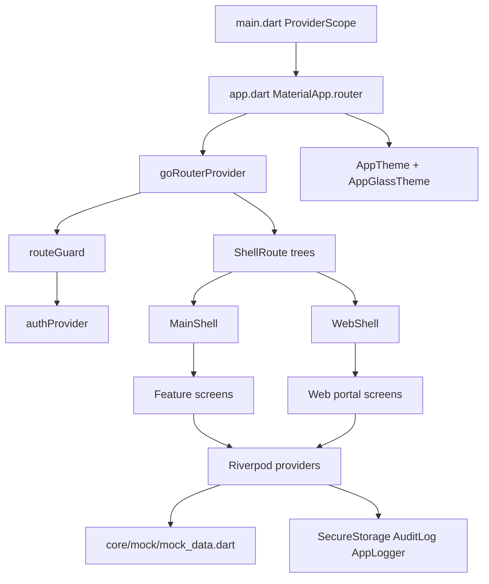
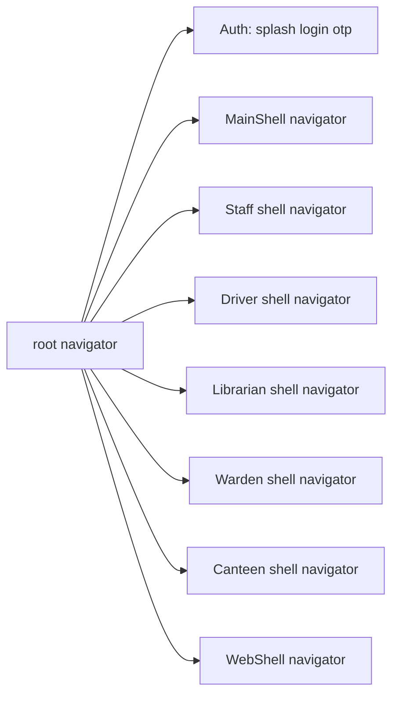
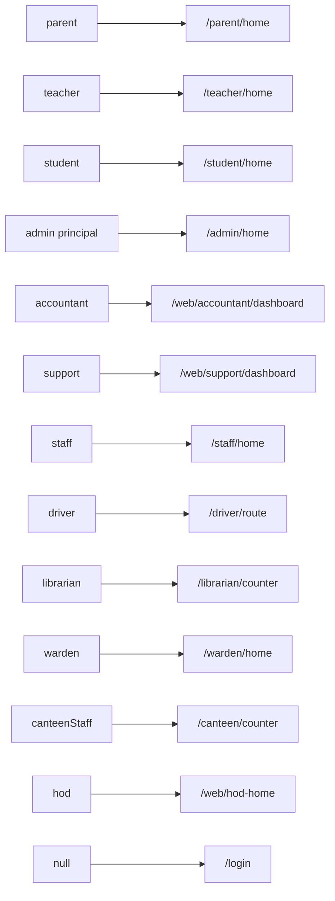
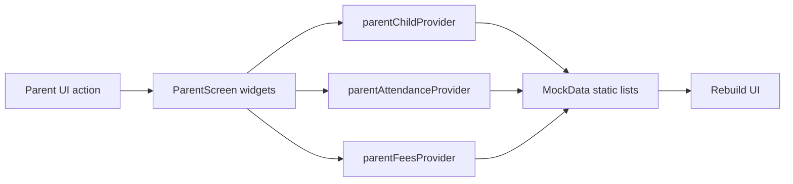

# NammaClass

**NammaClass** is a production-oriented **Flutter** frontend for a **multi-role school ERP** (50+ screens): parents, students, teachers, administration, HR/staff, transport, library, hostel, canteen, and a wide **web admin portal**. It targets **Android, iOS, Web, Windows, macOS, and Linux** with responsive shells, a shared design system, and **GoRouter + Riverpod** navigation and state.

| | |
|--|--|
| **App name** | `AppConstants.appName` → **NammaClass** ([`lib/core/constants/app_constants.dart`](lib/core/constants/app_constants.dart)) |
| **Tagline** | **Smart School. Happy Campus.** |
| **Demo school** | **Vidyashree Public School** |
| **Current data** | **Static mock data** in [`lib/core/mock/mock_data.dart`](lib/core/mock/mock_data.dart); no live backend required to run the UI |
| **Backend** | API shapes prepared in [`ApiConstants`](lib/core/constants/app_constants.dart) and [`EnvConfig`](lib/core/config/env_config.dart); [`StubApiClient`](lib/shared/services/api_client_provider.dart) returns `API not configured` |

---

## Table of contents

1. [Project overview](#1-project-overview)
2. [Tech stack](#2-tech-stack)
3. [Roles supported](#3-roles-supported)
4. [High-level architecture](#4-high-level-architecture)
5. [Folder structure](#5-folder-structure)
6. [App bootstrap](#6-app-bootstrap)
7. [Routing system](#7-routing-system)
8. [Auth and route guard](#8-auth-and-route-guard)
9. [Shells and responsiveness](#9-shells-and-responsiveness)
10. [Feature modules (A–Z)](#10-feature-modules-a--z)
11. [Design system](#11-design-system)
12. [Component libraries](#12-component-libraries)
13. [State management (Riverpod)](#13-state-management-riverpod)
14. [Models and data contracts](#14-models-and-data-contracts)
15. [Mock data layer](#15-mock-data-layer)
16. [Services and utilities](#16-services-and-utilities)
17. [Clean architecture scaffold (staged)](#17-clean-architecture-scaffold-staged)
18. [Backend integration plan](#18-backend-integration-plan)
19. [Coding approach and conventions](#19-coding-approach-and-conventions)
20. [Localization](#20-localization)
21. [Platform configuration](#21-platform-configuration)
22. [Debug instrumentation](#22-debug-instrumentation)
23. [Tests](#23-tests)
24. [Build and run](#24-build-and-run)
25. [Project status and known gaps](#25-project-status-and-known-gaps)
26. [Roadmap and further reading](#26-roadmap-and-further-reading)
27. [License and credits](#27-license-and-credits)

---

## 1. Project overview

NammaClass models a **full campus lifecycle**: admissions and students, academics (timetable, marks, report cards), fees and finance, payroll and staff, library and transport, inventory, communication (notices, analytics), IT support and accountant views, hostel and warden workflows, canteen (wallet for families/students/staff and POS/manager for staff), parent engagement (fees, diary, chat, bus, leave, complaints), and teacher tools including **attendance** and an embedded **timeline / roadmap** UI for planning.

The codebase is optimized for **clarity and scale**: feature folders, typed routes, role-based redirects, reusable **Nc\*** and **App\*** widgets, and centralized theme tokens.

---

## 2. Tech stack

Declared in [`pubspec.yaml`](pubspec.yaml) (SDK **`^3.10.1`**):

| Package | Role |
|---------|------|
| **flutter_riverpod** ^2.6.1 | App-wide and feature state; `ProviderScope` in [`lib/main.dart`](lib/main.dart) |
| **go_router** ^14.6.2 | Declarative routing, shells, redirects |
| **google_fonts** | Poppins / Inter / JetBrains Mono in [`lib/core/theme/app_typography.dart`](lib/core/theme/app_typography.dart) |
| **shimmer** | Loading placeholders (`NcShimmer*`) |
| **fl_chart** | Analytics charts on web dashboards |
| **badges** | Notification / count badges |
| **pin_code_fields** | OTP entry |
| **table_calendar** | Calendar-heavy screens (attendance, staff, etc.) |
| **cached_network_image** | Avatars and remote images |
| **flutter_animate** | Motion on select screens |
| **intl** | Dates, numbers, formatting |
| **package_info_plus** | App metadata |
| **url_launcher** | `tel:` and external links ([`lib/core/utils/launch_utils.dart`](lib/core/utils/launch_utils.dart)) |
| **flutter_secure_storage** | Token storage ([`lib/core/services/secure_storage.dart`](lib/core/services/secure_storage.dart)) |
| **dio** | HTTP client ([`lib/core/network/dio_client.dart`](lib/core/network/dio_client.dart), repositories) |
| **drift** / **drift_flutter** | Local SQLite ([`lib/core/storage/app_database.dart`](lib/core/storage/app_database.dart)) |
| **jwt_decoder** | JWT payload parsing ([`lib/core/network/jwt_tokens.dart`](lib/core/network/jwt_tokens.dart)) |
| **uuid** | Client ids for offline rows |
| **connectivity_plus** | Network reachability in repositories |
| **flutter_localizations** (SDK) | Declared; **not wired** in `MaterialApp` yet — see [Localization](#20-localization) |

**Linting:** `flutter_lints` ^6.0.0 via [`analysis_options.yaml`](analysis_options.yaml).

---

## 3. Roles supported

All roles are defined on [`UserRole`](lib/core/models/user_model.dart) (**13** values). One-line intent:

| Role | Responsibility |
|------|------------------|
| **parent** | Guardian portal: child info, fees, diary, chat, bus, notices, canteen wallet, leave, complaints |
| **teacher** | Class operations: timetable, attendance, diary, students, leave; may also use **staff** and **web** areas per guard |
| **student** | Learner: home, academics, library, canteen |
| **admin** | School ops: dashboard, approvals, broadcast, people; **web** portal |
| **principal** | Same home as admin (`adminHome`); **web** portal |
| **hod** | Department head: mobile `/hod/home`, web `/web/hod-home` and other `/web/*` where allowed |
| **staff** | HR self-service: attendance, leaves (reuse parent status screen), payslips, training, canteen |
| **driver** | Transport route and student boarding |
| **librarian** | Circulation, catalog, reservations; **web** library screens |
| **warden** | Hostel roll call, visitors, outpass |
| **canteenStaff** | Counter POS and manager back-office |
| **accountant** | Finance dashboard on web only (`/web/accountant/dashboard` as home) |
| **support** | IT support portal on web (`/web/support/dashboard` as home) |

Demo `UserModel` factories (e.g. `UserModel.parent`, `UserModel.teacher`, …) live in the same file for login-as-demo flows.

---

## 4. High-level architecture



**Flow:** `main` installs global error handling and debug hooks, wraps **`ProviderScope`**, then **`App`** wires **theme**, **router**, and a **full-screen gradient** behind routes. **`goRouterProvider`** rebuilds when **`authProvider`** changes; **`routeGuard`** enforces auth and role prefixes before each navigation.

---

## 5. Folder structure

Top-level **`lib/`** layout (conceptual; see repo for every file):

| Path | Purpose |
|------|---------|
| **`lib/main.dart`** | Entry: `runZonedGuarded`, `ErrorWidget.builder`, `ProviderScope`, `App` |
| **`lib/app.dart`** | `MaterialApp.router`, themes, `goRouterProvider`, gradient `builder` |
| **`lib/routing/`** | `app_routes.dart` (path constants), `app_router.dart`, `route_guard.dart`, `page_transitions.dart`, `auth_routes.dart`, `main_shell_routes.dart`, `staff_shell_routes.dart`, `driver_shell_routes.dart`, `librarian_shell_routes.dart`, `warden_shell_routes.dart`, `canteen_shell_routes.dart`, `web_shell_routes.dart` |
| **`lib/core/config/`** | `app_config.dart` (breakpoints, max width, animation ms, radius scale), `env_config.dart` (`APP_ENV`, `API_BASE_URL` via `--dart-define`) |
| **`lib/core/constants/`** | `app_constants.dart` (`AppConstants`, `ApiConstants`), `storage_keys.dart` |
| **`lib/core/debug/`** | `raw_keyboard_debug_log.dart` (Windows keyboard diagnostics) |
| **`lib/core/mock/`** | `mock_data.dart` — static domain data for all features |
| **`lib/core/models/`** | `user_model.dart`, `result.dart` |
| **`lib/core/network/`** | `dio_client.dart`, interceptors (staged; see [§17](#17-clean-architecture-scaffold-staged)) |
| **`lib/core/providers/`** | `theme_mode_provider.dart`, `data_sync_provider.dart`, `secure_storage_provider.dart` |
| **`lib/core/services/`** | `secure_storage.dart`, `audit_log.dart`, `app_logger.dart` |
| **`lib/core/storage/`** | Local persistence for staged sync (e.g. `AppDatabase`) |
| **`lib/core/theme/`** | `app_theme.dart`, `app_colors.dart`, `app_typography.dart`, `app_spacing.dart`, `app_glass_theme.dart` |
| **`lib/core/utils/`** | `validators.dart`, `sanitization.dart`, `formatters.dart`, `extensions.dart`, `screen_size.dart`, `launch_utils.dart`, `app_animations.dart`, `platform_utils.dart`, `agent_debug_logger*.dart` |
| **`lib/core/widgets/`** | Design primitives (`Nc*`), `shell_layout_scope.dart`, `role_guard.dart`, `error_fallback.dart`, `notification_icon_button.dart`, `app_drawer.dart` |
| **`lib/features/`** | **Feature modules** — `auth`, `admin`, `parent`, `student`, `teacher` (+ `widgets/timeline/`), `hod`, `staff`, `librarian`, `warden`, `driver`, `canteen`, `web` (subdomains), `shared`; plus **`main_shell.dart`**, **`web_shell.dart`** |
| **`lib/shared/`** | Cross-feature **`App*`** widgets and **`ApiClient`** / **`AuthService`** abstractions + stub provider |
| **`lib/domain/`** | Entities, repository interfaces, use cases (staged) |
| **`lib/data/`** | Repository implementations (staged) |
| **`lib/application/`** | Mappers, sync queue, **`di/repository_providers.dart`** (staged) |

---

## 6. App bootstrap

### `lib/main.dart`

- **`ErrorWidget.builder`** → [`ErrorFallback`](lib/core/widgets/error_fallback.dart) so build failures don’t show the default red error screen.
- **`runZonedGuarded`** — uncaught async errors go to [`AppLogger.instance.error`](lib/core/services/app_logger.dart).
- **`WidgetsFlutterBinding.ensureInitialized()`** before `runApp`.
- **Debug-only:** [`RawKeyboardDebugInstrumentation.install()`](lib/core/debug/raw_keyboard_debug_log.dart) when `!kReleaseMode`.
- **Root:** `const ProviderScope(child: App())`.

### `lib/app.dart`

- **`ConsumerWidget`** — watches `goRouterProvider` and `themeModeProvider`.
- **`MaterialApp.router`** — `title: 'NammaClass'`, `debugShowCheckedModeBanner: false`.
- **Themes:** `AppTheme.light`, `AppTheme.dark`, `themeMode` from [`themeModeProvider`](lib/core/providers/theme_mode_provider.dart) (defaults to `ThemeMode.light`).
- **`builder`:** wraps the router child in a **`Container`** with [`AppGlassTheme.backgroundGradientLight/Dark`](lib/core/theme/app_glass_theme.dart) from current brightness.

---

## 7. Routing system

### Composition and order

[`goRouterProvider`](lib/routing/app_router.dart) builds routes in this **order** (first match wins for overlapping patterns — keep this order when extending):

1. **`authRoutes`** — splash, login, OTP  
2. **`mainShellRoutes`** — parent, teacher, student, admin, HOD, shared paths  
3. **`staffShellRoutes`** — `/staff/*`  
4. **`driverShellRoutes`** — `/driver/*`  
5. **`librarianShellRoutes`** — `/librarian/*`  
6. **`wardenShellRoutes`** — `/warden/*`  
7. **`canteenShellRoutes`** — `/canteen/*`  
8. **`webShellRoutes`** — `/web/*`

**Navigator keys:** `_rootKey`, `_shellKey`, `_staffShellKey`, `_driverShellKey`, `_librarianShellKey`, `_wardenShellKey`, `_canteenShellKey`, `_webShellKey` — each shell gets its own nested navigator.

**Initial location:** [`AppRoutes.splash`](lib/routing/app_routes.dart).

**Narrow-screen HOD override:** After `routeGuard`, if the guard would redirect to **`webDashboard`**, **`webMarksEntry`**, or **`webHodHome`**, and `MediaQuery.sizeOf(context).width < 600`, and [`mobileHomeForExecRole`](lib/routing/route_guard.dart) returns a path (today: **HOD** → `hodHome`), that mobile path replaces the web redirect so HOD lands on mobile shell on phones.

**Transitions:** [`fadeSlideTransition`](lib/routing/page_transitions.dart) (`CustomTransitionPage`).

### Shell navigator tree (conceptual)



### Route inventory — Auth (no shell)

| Path | Screen |
|------|--------|
| `/splash` | [`splash_screen.dart`](lib/features/auth/screens/splash_screen.dart) |
| `/login` | [`login_screen.dart`](lib/features/auth/screens/login_screen.dart) |
| `/otp` | [`otp_screen.dart`](lib/features/auth/screens/otp_screen.dart) |

### Main shell (`MainShell`)

| Path | Screen |
|------|--------|
| `/parent/home` | `parent_home_screen.dart` |
| `/parent/attendance` | `parent_attendance_screen.dart` |
| `/parent/fees` | `parent_fees_screen.dart` |
| `/parent/diary` | `parent_diary_screen.dart` |
| `/parent/chat` | `parent_chat_list_screen.dart` |
| `/parent/chat/:tid` | `chat_thread_screen.dart` |
| `/parent/bus` | `bus_tracking_screen.dart` |
| `/parent/notices` | `parent_notices_screen.dart` |
| `/parent/canteen` | `canteen_screen.dart` → `FoodCanteenScreen` |
| `/parent/profile` | `profile_screen.dart` |
| `/parent/leave-apply` | `parent_leave_apply_screen.dart` |
| `/parent/leave-status` | `parent_leave_status_screen.dart` |
| `/parent/complaint-new` | `parent_complaint_new_screen.dart` |
| `/parent/complaints` | `parent_complaints_screen.dart` |
| `/teacher/home` | `teacher_home_screen.dart` |
| `/teacher/attendance` | `attendance_calendar_screen.dart` |
| `/teacher/attendance/mark` | `attendance_mark_screen.dart` |
| `/teacher/diary` | `diary_entry_screen.dart` |
| `/teacher/students` | `my_students_screen.dart` |
| `/teacher/profile` | `profile_screen.dart` |
| `/teacher/leave-apply` | `teacher_leave_apply_screen.dart` |
| `/teacher/leave-approvals` | `teacher_leave_approvals_screen.dart` |
| `/student/home` | `student_home_screen.dart` |
| `/student/academics` | `academics_screen.dart` |
| `/student/library` | `library_screen.dart` |
| `/student/canteen` | `canteen_screen.dart` |
| `/student/profile` | `profile_screen.dart` |
| `/admin/home` | `admin_dash_screen.dart` |
| `/admin/approvals` | `approvals_screen.dart` |
| `/admin/broadcast` | `broadcast_screen.dart` |
| `/admin/people` | `people_screen.dart` |
| `/admin/staff/add` | `features/web/staff/add_staff_screen.dart` |
| `/admin/profile` | `profile_screen.dart` |
| `/hod/home` | `hod_home_screen.dart` |
| `/hod/profile` | `profile_screen.dart` |
| `/notifications` | `notifications_screen.dart` |
| `/hostel` | `hostel_screen.dart` |
| `/profile` | `profile_screen.dart` |
| `/events` | `school_events_screen.dart` |
| `/search` | `global_search_screen.dart` |

Paths under `lib/features/` as listed above.

### Staff shell (`MainShell` + staff navigator)

| Path | Screen |
|------|--------|
| `/staff/home` | `staff_home_screen.dart` |
| `/staff/attendance` | `staff_attendance_screen.dart` |
| `/staff/leaves` | `parent_leave_status_screen.dart` (reuse) |
| `/staff/payslips` | `staff_payslips_screen.dart` |
| `/staff/training` | `staff_training_screen.dart` |
| `/staff/canteen` | `canteen_screen.dart` |
| `/staff/profile` | `profile_screen.dart` |

### Driver shell

| Path | Screen |
|------|--------|
| `/driver/route` | `driver_route_screen.dart` |
| `/driver/students` | `driver_students_screen.dart` |
| `/driver/profile` | `profile_screen.dart` |

### Librarian shell

| Path | Screen |
|------|--------|
| `/librarian/counter` | `librarian_counter_screen.dart` |
| `/librarian/catalog` | `librarian_catalog_screen.dart` |
| `/librarian/reservations` | `librarian_reservations_screen.dart` |
| `/librarian/profile` | `profile_screen.dart` |

### Warden shell

| Path | Screen |
|------|--------|
| `/warden/home` | `warden_home_screen.dart` |
| `/warden/rollcall` | `warden_rollcall_screen.dart` |
| `/warden/visitors` | `warden_visitors_screen.dart` |
| `/warden/outpass` | `warden_outpass_screen.dart` |
| `/warden/profile` | `profile_screen.dart` |

### Canteen shell

| Path | Screen |
|------|--------|
| `/canteen/counter` | `canteen_counter_screen.dart` |
| `/canteen/manage` | `canteen_manager_screen.dart` |
| `/canteen/profile` | `profile_screen.dart` |

### Web shell (`WebShell`)

All registered in [`web_shell_routes.dart`](lib/routing/web_shell_routes.dart):

| Path | Screen (under `lib/features/web/`) |
|------|-------------------------------------|
| `/web/hod-home` | `hod_home_screen.dart` |
| `/web/dashboard` | `dashboard/web_dashboard_screen.dart` |
| `/web/analytics` | `analytics/web_analytics_screen.dart` |
| `/web/students` | `students/web_students_screen.dart` |
| `/web/students/:id` | `students/web_student_profile.dart` |
| `/web/timetable` | `academics/web_timetable_screen.dart` |
| `/web/marks` | `academics/web_marks_entry_screen.dart` |
| `/web/fees/structure` | `fees/web_fee_structure_screen.dart` |
| `/web/fees/collection` | `fees/web_fee_collection_screen.dart` |
| `/web/staff` | `staff/web_staff_screen.dart` |
| `/web/staff/add` | `staff/add_staff_screen.dart` |
| `/web/payroll` | `staff/web_payroll_screen.dart` |
| `/web/notices` | `communication/web_notices_screen.dart` |
| `/web/library` | `library/web_library_screen.dart` |
| `/web/settings` | `settings/web_settings_screen.dart` |
| `/web/ai` | `ai_tools/web_ai_tools_screen.dart` |
| `/web/website` | `website/web_website_manager_screen.dart` |
| `/web/admissions` | `admissions/web_admission_dashboard_screen.dart` |
| `/web/admissions/enquiries` | `admissions/web_enquiries_screen.dart` |
| `/web/admissions/applications/:id` | `admissions/web_application_detail_screen.dart` |
| `/web/students/promote` | `students/web_bulk_promotion_screen.dart` |
| `/web/fees/collect` | `fees/web_fee_collect_screen.dart` |
| `/web/finance/ledger` | `finance/web_finance_ledger_screen.dart` |
| `/web/report-cards` | `academics/web_report_card_builder_screen.dart` |
| `/web/communication/analytics` | `communication/web_communication_analytics_screen.dart` |
| `/web/library/reports` | `library/web_library_reports_screen.dart` |
| `/web/transport/routes` | `transport/web_transport_routes_screen.dart` |
| `/web/transport/live` | `transport/web_transport_live_screen.dart` |
| `/web/inventory/assets` | `inventory/web_inventory_assets_screen.dart` |
| `/web/inventory/stock` | `inventory/web_inventory_stock_screen.dart` |
| `/web/reports/builder` | `analytics/web_report_builder_screen.dart` |
| `/web/settings/users` | `settings/web_user_management_screen.dart` |
| `/web/settings/integrations` | `settings/web_integrations_screen.dart` |
| `/web/settings/security-log` | `settings/web_security_log_screen.dart` |
| `/web/support/dashboard` | `support/web_support_dashboard_screen.dart` |
| `/web/support/tickets` | `support/web_support_tickets_screen.dart` |
| `/web/support/complaints` | `support/web_support_complaints_screen.dart` |
| `/web/support/kb` | `support/web_support_knowledge_base_screen.dart` |
| `/web/accountant/dashboard` | `accountant/web_accountant_dashboard_screen.dart` |

---

## 8. Auth and route guard

[`routeGuard(path, authState)`](lib/routing/route_guard.dart) returns a **redirect path** or **`null`** to allow navigation.

### Public paths

Unauthenticated users may only access: **`/splash`**, **`/login`**, **`/otp`**. Anything else → **`/login`**.

### Authenticated redirect from entry

If authenticated and path is **`/`**, **`/splash`**, or **`/login`** → redirect to **role home** (see table below).

### Shared authenticated paths (any role)

- `AppRoutes.notifications` (`/notifications`)
- `AppRoutes.hostel` (`/hostel`)
- `AppRoutes.events` (`/events`)
- `AppRoutes.search` (`/search`)
- **`/profile`** (string literal; same as `AppRoutes.profile`)

**Note:** Role-specific profiles like `/parent/profile` are enforced by the **`/parent/`** prefix, not by the shared `/profile` entry alone.

### Prefix → allowed roles (`_rolePrefixMap`)

| Prefix | Roles |
|--------|--------|
| `/parent/` | parent |
| `/teacher/` | teacher |
| `/student/` | student |
| `/admin/` | admin, principal, hod |
| `/staff/` | staff, **teacher** |
| `/driver/` | driver |
| `/librarian/` | librarian |
| `/warden/` | warden |
| `/canteen/` | canteenStaff |
| `/hod/` | hod |
| `/web/` | admin, principal, accountant, teacher, librarian, support, hod |

If the path starts with a mapped prefix and the user’s role is missing or not in the set → redirect to **role home**.

### Role → default home (`_roleHome`)



**Important:** If a path does **not** match any prefix and is not a shared path, the guard returns **`null`** (navigation allowed). Unknown or legacy URLs may therefore slip through for authenticated users — tighten by adding explicit deny rules if needed.

---

## 9. Shells and responsiveness

### `MainShell` ([`lib/features/main_shell.dart`](lib/features/main_shell.dart))

- Uses [`ScreenSize`](lib/core/utils/screen_size.dart): **mobile &lt; 600**, **tablet 600–1023**, **desktop ≥ 1024** (distinct from `AppConfig.breakpointMd/Lg` at 900/1200 — both exist).
- **Wide:** `ShellLayoutScope(hasPersistentTopBar: true)` + sidebar (**240 ↔ 64** collapsed) + top bar (search → `/search`, notifications, avatar → role profile) + nested `child`.
- **Narrow:** bottom **`NavigationBar`** (floating style); body is the nested route.
- **Destinations:** `_destinationsFor(role)` supplies tab routes/labels/icons per `UserRole`.

### `WebShell` ([`lib/features/web_shell.dart`](lib/features/web_shell.dart))

- **Mobile:** compact top bar + bottom nav (menu may be capped to first items).
- **Desktop/tablet:** sidebar + top bar; content max width **1400** (aligns with `AppConfig.maxContentWidth`).
- **Menus:** `_menuItemsFor(role)` — shorter lists for librarian, support, accountant, HOD vs default admin/teacher-style menus.

### `ShellLayoutScope` ([`lib/core/widgets/shell_layout_scope.dart`](lib/core/widgets/shell_layout_scope.dart))

Inherited flag **`hasPersistentTopBar`**. Screens call **`ShellLayoutScope.appBar(context, …)`** to return **`null`** when the shell already draws a top bar (avoids double `AppBar`s).

### Breakpoints summary

| Source | Values |
|--------|--------|
| [`AppConfig`](lib/core/config/app_config.dart) | xs 0, sm **600**, md **900**, lg **1200**, xl **1600**; `maxContentWidth` **1400** |
| [`ScreenSize`](lib/core/utils/screen_size.dart) | mobile &lt; **600**, desktop ≥ **1024** |

Use **`ResponsiveBuilder`** / **`ConstrainedContent`** with **`AppConfig`** for content; use **`ScreenSize`** / **`ContextX`** where the shell already does.

---

## 10. Feature modules (A–Z)

### Auth (`lib/features/auth/`)

| Route | Purpose |
|-------|---------|
| `/splash` | Session / branding entry |
| `/login` | Phone login; demo role picker |
| `/otp` | OTP verification UI |

**State:** [`auth_provider.dart`](lib/features/auth/providers/auth_provider.dart) — `AuthState`, `AuthNotifier`, `loginAs`, `logout`, secure storage on logout.

### Admin (`lib/features/admin/`)

| Route | Purpose |
|-------|---------|
| `/admin/home` | KPIs and school overview |
| `/admin/approvals` | Approval queues |
| `/admin/broadcast` | Broadcast composer |
| `/admin/people` | People directory |
| `/admin/staff/add` | Add staff flow (web screen hosted in admin route) |

**State:** `admin_providers.dart`, `staff_notifier.dart`.

### Parent (`lib/features/parent/`)

Guardian-facing screens (see [Main shell](#main-shell-mainshell) table). **Providers:** `parent_providers.dart` — child, timetable, attendance, fees, diary, chat threads/messages, notices, canteen menu, leave applications.

### Student (`lib/features/student/`)

Home, academics (timetable / homework / attendance), library (search, self-issue, history), canteen. **Providers:** `student_providers.dart`.

### Teacher (`lib/features/teacher/`)

Attendance calendar + mark screen, diary, my students, leave apply/approvals, home. **Embedded roadmap:** [`attendance_calendar_screen.dart`](lib/features/teacher/screens/attendance_calendar_screen.dart) hosts **`TimelineRoadmapView`**.

#### Timeline / roadmap widgets (`lib/features/teacher/widgets/timeline/`)

| File | Role |
|------|------|
| `timeline_roadmap_view.dart` | Orchestrator: scroll sync, zoom, hierarchy + canvas + toolbar |
| `timeline_canvas.dart` | Lanes, rows, selection; hosts task bars + dependency layer |
| `timeline_header.dart` | Time axis (months/days), horizontal scroll |
| `timeline_hierarchy_panel.dart` | Left “work breakdown” tree |
| `timeline_task_bar.dart` | Draggable/resizable bars, tooltips, status colors |
| `timeline_dependency_layer.dart` | `CustomPaint` links between tasks |
| `timeline_filters_toolbar.dart` | Zoom and filters (wired to `teacherTimelineProvider`) |
| `timeline_view_utils.dart` | Layout math: lane layout, cell widths, labels |

**Models:** [`timeline_models.dart`](lib/features/teacher/models/timeline_models.dart). **State:** `teacherTimelineProvider` and related in [`teacher_providers.dart`](lib/features/teacher/providers/teacher_providers.dart).

### HOD (`lib/features/hod/`)

Single screen: **`hod_home_screen.dart`** — mobile `/hod/home`, web `/web/hod-home`.

### Staff (`lib/features/staff/`)

HR portal routes under `/staff/*` (see table). **Providers:** `staff_providers.dart`.

### Librarian (`lib/features/librarian/`)

Counter, catalog, reservations. **State:** `libraryBookIssuesProvider` + borrower helpers in [`library_provider.dart`](lib/features/librarian/providers/library_provider.dart).

### Warden (`lib/features/warden/`)

Home, roll call, visitors, outpass. **State:** `wardenHostelStudentsProvider`, `wardenOutpassesProvider`.

### Driver (`lib/features/driver/`)

Route and students/boarding. **State:** `driverBusStopsProvider`, `driverStopStudentsProvider`.

### Canteen (`lib/features/canteen/`)

- **Consumer:** [`food_canteen_screen.dart`](lib/features/canteen/screens/food_canteen_screen.dart) via `CanteenScreen` on parent/student/staff routes (not the unused `/food` constant — see [Gaps](#25-project-status-and-known-gaps)).
- **Staff ops:** `canteen_counter_screen.dart`, `canteen_manager_screen.dart` on `/canteen/*`.
- **State:** `canteen_provider.dart` (`canteenStateProvider`, `canteenMenuProvider`, `studentMealComboProvider`, …).

### Web (`lib/features/web/`)

Sub-areas: `dashboard`, `analytics`, `students`, `academics`, `fees`, `finance`, `staff`, `communication`, `library`, `transport`, `inventory`, `admissions`, `settings`, `support`, `accountant`, `ai_tools`, `website`, plus [`web_providers.dart`](lib/features/web/providers/web_providers.dart) for async mocks (admissions, assets, bus stops, book issues, reservations).

### Shared (`lib/features/shared/`)

Profile, notifications (+ library overdue merge), global search, hostel tabs, school events. **Providers:** `notification_service.dart`, `notices_for_user_provider.dart`, `hostel_provider.dart`.

---

## 11. Design system

### Colors ([`lib/core/theme/app_colors.dart`](lib/core/theme/app_colors.dart))

| Token | Light / notes |
|-------|----------------|
| **primary** | `#1B4F72` |
| **primaryDark** | `#163A57` |
| **accent** | `#E67E22` |
| **success** / **teal** / **error** / **warning** | Semantic greens/teal/red/amber |
| **background** | `#F4F6F7` |
| **card** | white |
| **divider** | `#CCCCCC` |
| **sidebarBg** | `#0D2137` |
| **textPrimary** / **textSecondary** / **textDisabled** | Body hierarchy |
| **shimmerBase** / **shimmerHighlight** | Loading shimmer |
| **successBg** / **errorBg** / **warningBg** / **leaveBg** | Chip backgrounds |
| **Dark** | `backgroundDark`, `cardDark`, `textPrimaryDark`, `textSecondaryDark`, `dividerDark` |
| **Gradients** | `primaryGradient`, `accentGradient`, `successGradient`, `errorGradient` |
| **Shadows** | `shadowSm`, `shadowMd`, `shadowLg` |

### Typography ([`lib/core/theme/app_typography.dart`](lib/core/theme/app_typography.dart))

- **Poppins:** displayLarge (30/700), displayMedium (26/600), headlineLarge (22/600), headlineMedium (18/600), headlineSmall (16/500).
- **Inter:** bodyLarge (16/400), bodyMedium (14/400), bodySmall (12/400, secondary color), labelLarge/Medium/Small.
- **JetBrains Mono:** `monoAmount` for currency/amounts.

### Spacing, radius, elevation ([`lib/core/theme/app_spacing.dart`](lib/core/theme/app_spacing.dart))

| Class | Tokens |
|-------|--------|
| **AppSpacing** | xxs 4, xs 8, sm 12, md 16, lg 24, xl 32, xxl 48 |
| **AppRadius** | xs 4, sm 8, md 12, lg 16, xl 24, full 999 |
| **AppElevation** | low 2, mid 4, high 8 |

### Theme assembly ([`lib/core/theme/app_theme.dart`](lib/core/theme/app_theme.dart))

Material 3 **light** and **dark** `ThemeData`: color scheme from `AppColors`, component themes (AppBar, Card, buttons, inputs, `NavigationBar`, chips, dialogs, sheets, etc.).

### App background ([`lib/core/theme/app_glass_theme.dart`](lib/core/theme/app_glass_theme.dart))

- **Light gradient:** `#F4F6F7` → `#E8ECF0`
- **Dark gradient:** `#0F172A` → `#1E293B` → `#020617`

---

## 12. Component libraries

### `Nc*` — [`lib/core/widgets/`](lib/core/widgets/)

| Widget | Purpose |
|--------|---------|
| **NcPrimaryButton** / **NcSecondaryButton** | Primary / secondary actions ([`nc_button.dart`](lib/core/widgets/nc_button.dart)) |
| **NcCard** | Card container ([`nc_card.dart`](lib/core/widgets/nc_card.dart)) |
| **NcTextField** / **NcDropdown&lt;T&gt;** | Form controls ([`nc_input.dart`](lib/core/widgets/nc_input.dart)) |
| **NcStatusChip** / **NcChip** | Status / generic chips ([`nc_chip.dart`](lib/core/widgets/nc_chip.dart)) |
| **NcAvatar** | Image or initials ([`nc_avatar.dart`](lib/core/widgets/nc_avatar.dart)) |
| **NcEmptyState** | Empty states with illustration enum ([`nc_empty_state.dart`](lib/core/widgets/nc_empty_state.dart)) |
| **NcAsyncError** | Async error UI ([`nc_async_error.dart`](lib/core/widgets/nc_async_error.dart)) |
| **NcBottomSheet** | Sheet helper ([`nc_bottom_sheet.dart`](lib/core/widgets/nc_bottom_sheet.dart)) |
| **NcShimmerBox/Circle/Card/List/StatCard** | Loading skeletons ([`nc_shimmer.dart`](lib/core/widgets/nc_shimmer.dart)) |

Also: **`ShellLayoutScope`**, **`RoleGuard`**, **`ErrorFallback`**, **`NotificationIconButton`**, **`AppDrawer`**.

### `App*` — [`lib/shared/widgets/`](lib/shared/widgets/)

| Widget | Purpose |
|--------|---------|
| **ConstrainedContent** | Max width + centering ([`layout/constrained_content.dart`](lib/shared/widgets/layout/constrained_content.dart)) |
| **ResponsiveBuilder** | Breakpoint-based layout ([`layout/responsive_builder.dart`](lib/shared/widgets/layout/responsive_builder.dart)) |
| **AppCard**, **AppStatCard**, **AppListTileCard** | Cards ([`cards/`](lib/shared/widgets/cards/)) |
| **AppDialog**, **AppSkeleton**, **AppSkeletonList**, **AppSnackBar** | Feedback ([`feedback/`](lib/shared/widgets/feedback/)) |
| **AppListView&lt;T&gt;** | Skeleton / empty / list ([`lists/app_list_view.dart`](lib/shared/widgets/lists/app_list_view.dart)) |
| **AppDataTable&lt;T&gt;** | Table vs mobile list ([`tables/app_data_table.dart`](lib/shared/widgets/tables/app_data_table.dart)) |
| **AppAppBar**, **AppButton**, **AppIconButton** | Navigation / actions |
| **AppTextField**, **AppRadio**, **AppCheckbox**, **AppDropdown** | Inputs |

**Convention:** Prefer **`Nc*`** on feature screens for visual consistency; use **`App*`** for layout primitives, tables, and generic feedback patterns.

---

## 13. State management (Riverpod)

### Core / routing

| Provider | File | Role |
|----------|------|------|
| `goRouterProvider` | `lib/routing/app_router.dart` | `GoRouter` instance |
| `themeModeProvider` | `lib/core/providers/theme_mode_provider.dart` | `ThemeMode` toggle |
| `dataSyncProvider` | `lib/core/providers/data_sync_provider.dart` | Global revision `bump()` when mock lists mutate |
| `apiClientProvider` | `lib/shared/services/api_client_provider.dart` | `StubApiClient` |

### Auth

| Provider | File |
|----------|------|
| `secureStorageProvider` | [`lib/core/providers/secure_storage_provider.dart`](lib/core/providers/secure_storage_provider.dart) |
| `authProvider`, `isAuthenticatedProvider`, `currentUserProvider`, `userRoleProvider` | [`lib/features/auth/providers/auth_provider.dart`](lib/features/auth/providers/auth_provider.dart) |

`AuthNotifier` and [`dio_client.dart`](lib/core/network/dio_client.dart) both read the same **`secureStorageProvider`** from core.

### Notifications / notices

| Provider | File |
|----------|------|
| `notificationServiceProvider`, `unreadNotificationsCountProvider` | `lib/features/shared/notifications/notification_service.dart` |
| `libraryOverdueDismissedProvider`, `noticesForCurrentUserProvider`, `unreadNoticeCountForUserProvider` | `lib/features/shared/notifications/notices_for_user_provider.dart` |
| `hostelMyRoomProvider` | `lib/features/shared/hostel/hostel_provider.dart` |

### Feature providers (representative list)

| Module | Providers |
|--------|-----------|
| **Student** | `studentTimetableProvider`, `studentHomeworkProvider`, `studentAttendanceProvider`, `studentBooksProvider`, `studentNoticesProvider` |
| **Parent** | `parentChildProvider`, `parentLeaveApplicationsProvider`, `parentTimetableProvider`, `parentAttendanceProvider`, `parentFeesProvider`, `parentDiaryProvider`, `parentChatThreadsProvider`, `parentMessagesProvider`, `parentNoticesProvider`, `parentCanteenMenuProvider` |
| **Teacher** | `teacherStudentsProvider`, `teacherTimetableProvider`, `attendanceMarkProvider`, `teacherDiaryProvider`, `teacherTimelineProvider` |
| **Staff** | `staffAttendanceProvider`, `staffPayslipsProvider`, `staffTrainingsProvider` |
| **Driver** | `driverBusStopsProvider`, `driverStopStudentsProvider` |
| **Warden** | `wardenHostelStudentsProvider`, `wardenOutpassesProvider` |
| **Librarian** | `libraryBookIssuesProvider` |
| **Canteen** | `canteenStateProvider`, `canteenMenuProvider`, `studentMealComboProvider` |
| **Admin** | `adminDashboardKpisProvider`, `adminStudentsProvider`, `adminStaffProvider`, `adminNoticesProvider`, `adminApprovalsProvider`, `staffNotifierProvider` |
| **Web** | `webAdmissionEnquiriesProvider`, `webAssetsProvider`, `webBusStopsProvider`, `webBookIssuesProvider`, `webReservationsProvider` |

### Parent data flow (example)



---

## 14. Models and data contracts

| Artifact | Location | Notes |
|----------|----------|-------|
| **`UserRole`**, **`UserModel`**, demo users | [`lib/core/models/user_model.dart`](lib/core/models/user_model.dart) | Fields: `id`, `name`, `role`, `phone`, optional `email`, `avatarUrl`, `schoolId`, `tenantId`, `branchId`, `permissions`, `classSection`, `employeeId`, `studentId`; getters `displayName`, `roleLabel`; `copyWith` |
| **`Result&lt;T&gt;`** | [`lib/core/models/result.dart`](lib/core/models/result.dart) | Sealed: `ResultSuccess`, `ResultError` — used by `ApiClient` |
| **Timeline types** | [`lib/features/teacher/models/timeline_models.dart`](lib/features/teacher/models/timeline_models.dart) | Tasks, dependencies, zoom, statuses |

Mock-specific types (`MockStudent`, `MockBook`, …) live in [`mock_data.dart`](lib/core/mock/mock_data.dart).

---

## 15. Mock data layer

[`MockData`](lib/core/mock/mock_data.dart) is the **single in-repo datasource** for UI today. Highlights (static / mutable lists as implemented):

- **Students**, **attendance** (e.g. generated ranges), **fees**, **diary**, **chat** threads/messages, **notices**
- **Timetable** map, **teacher attendance sessions**, **books**, **book issues**, **reservations**
- **Staff** list, **canteen** menu/combos/subscriptions/wallets/orders/transactions**, **`dashboardKpis`**, **`busInfo`**
- **Leave** applications and balance, **complaints**, **support** tickets, **KB** articles, **events**
- **Staff attendance**, **payslips**, **trainings**, **driver** stops / per-stop students
- **Hostel** students, **outpasses**, **visitors**, **admission** enquiries, **assets**, **HOD** department string, **staff leave requests** for HOD views

**Mutation pattern:** some notifiers write back into `MockData.*` and call **`dataSyncProvider.notifier.bump()`** so other providers refresh.

---

## 16. Services and utilities

| Area | Files | Role |
|------|-------|------|
| **Secure storage** | [`secure_storage.dart`](lib/core/services/secure_storage.dart) | `FlutterSecureStorage` for tokens / user id keys from [`storage_keys.dart`](lib/core/constants/storage_keys.dart) |
| **Audit** | [`audit_log.dart`](lib/core/services/audit_log.dart) | In-memory ring buffer of `AuditEvent` (max 200) |
| **Logging** | [`app_logger.dart`](lib/core/services/app_logger.dart) | `debug` / `info` / `error` (debug console) |
| **Validators** | [`validators.dart`](lib/core/utils/validators.dart) | Required, Indian phone, email, OTP length, combine |
| **Sanitization** | [`sanitization.dart`](lib/core/utils/sanitization.dart) | Trim, max length, email normalize |
| **Formatters** | [`formatters.dart`](lib/core/utils/formatters.dart) | Dates, INR, `timeAgo`, etc. |
| **Extensions** | [`extensions.dart`](lib/core/utils/extensions.dart) | `StringX`, `DateTimeX`, `NumX`, `ContextX` (includes `isMobile` at 600px) |
| **Screen size** | [`screen_size.dart`](lib/core/utils/screen_size.dart) | Mobile / tablet / desktop breakpoints |
| **Launch** | [`launch_utils.dart`](lib/core/utils/launch_utils.dart) | `url_launcher` for `tel:` |
| **Animations** | [`app_animations.dart`](lib/core/utils/app_animations.dart) | Durations, curves, page transitions |
| **Platform** | [`platform_utils.dart`](lib/core/utils/platform_utils.dart) | **`isWebPlatform` is not a real web check** — uses `ThemeData().brightness` (see gaps) |

---

## 17. Clean architecture scaffold (staged)

The repo includes a **partial clean-architecture layer** not yet wired from most UI:

| Layer | Path | Contents |
|-------|------|----------|
| **Domain** | `lib/domain/` | `entities/`, `repositories/*.dart`, `usecases/` |
| **Data** | `lib/data/` | `repositories/*_impl.dart` |
| **Application** | `lib/application/` | `auth/auth_mapper.dart`, `sync/sync_queue_service.dart`, **`di/repository_providers.dart`** |
| **Network** | `lib/core/network/` | `dio_client.dart` (`dioProvider`), `auth_interceptor.dart` |
| **Storage** | `lib/core/storage/` | `app_database.dart` and related local persistence |

[`repository_providers.dart`](lib/application/di/repository_providers.dart) registers repositories and use cases (`LoginDemoUseCase`, `SendOtpUseCase`, `GetStudentsPageUseCase`, …). **Grep shows no feature imports of these providers yet** — screens still use **`MockData`** + feature `FutureProvider`s.

**Dependencies:** [`pubspec.yaml`](pubspec.yaml) includes **`dio`**, **`drift`**, **`drift_flutter`**, and dev **`drift_dev`** / **`build_runner`** for code generation. Run `dart run build_runner build` if you change [`app_database.dart`](lib/core/storage/app_database.dart).

---

## 18. Backend integration plan

1. **HTTP client:** Implement [`ApiClient`](lib/shared/services/api_client.dart) (e.g. Dio) and replace `StubApiClient` in [`api_client_provider.dart`](lib/shared/services/api_client_provider.dart).
2. **Env:** Set `API_BASE_URL` via `--dart-define=API_BASE_URL=https://...` ([`EnvConfig`](lib/core/config/env_config.dart)).
3. **Auth:** Implement [`AuthService`](lib/shared/services/auth_service.dart); connect **`authProvider`** / OTP screens to real **`AuthRepository`** flows in `lib/data/` + use cases, or merge with existing `AuthNotifier` semantics.
4. **Feature providers:** Swap `MockData` reads for repository calls; keep **`Result&lt;T&gt;`** / **`AsyncValue`** error handling patterns.
5. **API paths:** Align implementations with [`ApiConstants`](lib/core/constants/app_constants.dart) (`https://api.nammaclass.in/v1` base string — adjust per environment).

---

## 19. Coding approach and conventions

1. **Feature-first:** `lib/features/<role>/{screens,providers,models,widgets}/`.
2. **Routing:** Add constants to [`app_routes.dart`](lib/routing/app_routes.dart); register `GoRoute` in the correct shell file; navigate with `context.go` / `context.push` and **`AppRoutes`**.
3. **State:** Riverpod `Provider` / `FutureProvider` / `StateNotifierProvider`; watch in `ConsumerWidget` / `ConsumerStatefulWidget`.
4. **Layout:** Wrap page content with **`ConstrainedContent`** and use **`ResponsiveBuilder`** when layout branches on breakpoints; use **`ShellLayoutScope.appBar`** to skip duplicate app bars inside shells.
5. **Theming:** Use **`AppColors`**, **`AppSpacing`**, **`AppTypography`** — avoid hard-coded hex in feature code.
6. **Forms:** Reuse **`AppValidators`** and **`Sanitization`**.
7. **Errors:** Root **`ErrorWidget.builder`**; async UIs use **`NcAsyncError`** or `AsyncValue.when`.
8. **Logging:** `AppLogger`; heavy debug only under **`kDebugMode`**.
9. **Linting:** Follow **`flutter_lints`** defaults in [`analysis_options.yaml`](analysis_options.yaml).

### Adding a new screen (checklist)

1. Add **`AppRoutes.*`** constant in [`app_routes.dart`](lib/routing/app_routes.dart).
2. Create screen under `lib/features/<feature>/screens/`.
3. Register **`GoRoute`** in the correct router module (`auth_routes.dart`, `main_shell_routes.dart`, `web_shell_routes.dart`, or other shell).
4. If role-restricted, ensure [`route_guard.dart`](lib/routing/route_guard.dart) prefix map includes the path prefix (or mark as shared).
5. Add navigation from an existing shell menu or button.
6. Add / update tests under `test/` if behavior is non-trivial.

### Adding a new feature module

- Create `lib/features/<name>/` with `screens/`, optional `providers/`, `widgets/`.
- Reuse **`Nc*`** / **`App*`** and theme tokens.
- Export routes from a dedicated `*_routes.dart` if the router file grows too large.

---

## 20. Localization

- [`pubspec.yaml`](pubspec.yaml) sets **`generate: true`** and depends on **`flutter_localizations`**.
- There is **no** `lib/l10n/`, **no** `.arb` files, and **`MaterialApp.router`** in [`app.dart`](lib/app.dart) does **not** set `localizationsDelegates`, `supportedLocales`, or `locale`.
- **Action to enable i18n:** add ARB files, run `flutter gen-l10n`, wire delegates and locales in `App`, and replace user-visible strings gradually.

---

## 21. Platform configuration

| Platform | Identifier / notes |
|----------|---------------------|
| **Android** | `applicationId` / namespace **`com.example.nammaclass`** in `android/app/build.gradle.kts`; SDK versions from Flutter template; [`AndroidManifest.xml`](android/app/src/main/AndroidManifest.xml) has no dangerous `uses-permission` entries in the default template |
| **iOS** | Bundle **`com.example.nammaclass`**; display name **Nammaclass**; see `ios/Runner/Info.plist` / `project.pbxproj` |
| **Web** | [`web/index.html`](web/index.html) title **nammaclass**; [`web/manifest.json`](web/manifest.json) **PWA**-style `standalone`, `theme_color` **`#0175C2`** |
| **Windows** | Title **nammaclass**, initial size **1280×720** in [`windows/runner/main.cpp`](windows/runner/main.cpp) |
| **macOS** | `PRODUCT_BUNDLE_IDENTIFIER = com.example.nammaclass` in [`macos/Runner/Configs/AppInfo.xcconfig`](macos/Runner/Configs/AppInfo.xcconfig) |
| **Linux** | `APPLICATION_ID "com.example.nammaclass"` in [`linux/CMakeLists.txt`](linux/CMakeLists.txt) |

**Assets:** `assets/images/` and `assets/icons/` are registered in **`pubspec.yaml`** but may be **empty** — add real assets as needed.

---

## 22. Debug instrumentation

| Tool | File | Behavior |
|------|------|----------|
| **Raw keyboard debug** | [`lib/core/debug/raw_keyboard_debug_log.dart`](lib/core/debug/raw_keyboard_debug_log.dart) | NDJSON to `debug-9fba24.log` (cwd): lifecycle + keyboard-related `FlutterError` details — Windows **Alt** / embedder investigations |
| **Agent debug logger** | [`lib/core/utils/agent_debug_logger.dart`](lib/core/utils/agent_debug_logger.dart) | Conditional export: IO → `debug-c2209d.log`; stub on non-IO |
| **Windows runner notes** | [`docs/WINDOWS_FLUTTER_DEBUG.md`](docs/WINDOWS_FLUTTER_DEBUG.md) | Alt-key workaround, timeline hot-reload caveats |

Timeline widgets optionally log canvas/toolbar timings in debug.

---

## 23. Tests

| Test file | Purpose |
|-----------|---------|
| [`test/widget_test.dart`](test/widget_test.dart) | Smoke: `ProviderScope` + `App`, finds `MaterialApp` |
| [`test/features/teacher/timeline_provider_test.dart`](test/features/teacher/timeline_provider_test.dart) | `teacherTimelineProvider` move / dependency behavior |
| [`test/features/teacher/timeline_roadmap_view_test.dart`](test/features/teacher/timeline_roadmap_view_test.dart) | Widget test: roadmap labels / toolbar |

**Patterns:** `flutter_test`, `ProviderContainer` / `ProviderScope`, `test` / `testWidgets`.

---

## 24. Build and run

```bash
flutter pub get
flutter run                    # default device
flutter run -d chrome          # web
flutter run -d windows       # Windows desktop
flutter run -d macos
flutter run -d linux
```

**Environment:**

```bash
flutter run --dart-define=APP_ENV=staging --dart-define=API_BASE_URL=https://api.example.com/v1
```

Release builds per platform use standard `flutter build apk|appbundle|ipa|web|windows|macos|linux`.

---

## 25. Project status and known gaps

| Gap | Detail |
|-----|--------|
| **Dead route constants** | [`AppRoutes.foodMenu`](lib/routing/app_routes.dart) (`/food`), [`webTransport`](lib/routing/app_routes.dart) (`/web/transport`), [`webHostel`](lib/routing/app_routes.dart) (`/web/hostel`) — **no matching `GoRoute`**; canteen consumer uses **`/parent/canteen`**, **`/student/canteen`**, **`/staff/canteen`**. |
| **Guard allow-all tail** | [`routeGuard`](lib/routing/route_guard.dart) returns **`null`** for paths that match **no** prefix and are not shared — unknown URLs may still load if a route exists. |
| **`PlatformUtils.isWebPlatform`** | Uses **`kIsWeb`** from `foundation.dart` ([`platform_utils.dart`](lib/core/utils/platform_utils.dart)). |
| **Localization** | Package present; **not wired** in `MaterialApp`. |
| **Dual breakpoints** | [`AppConfig`](lib/core/config/app_config.dart) vs [`ScreenSize`](lib/core/utils/screen_size.dart) — document which each new screen uses. |
| **PHASE6 doc vs code** | [`docs/PHASE6_DELIVERABLES.md`](docs/PHASE6_DELIVERABLES.md) role matrix may mention personas not present in [`UserRole`](lib/core/models/user_model.dart) — **trust the Dart enum** as source of truth. |

---

## 26. Roadmap and further reading

- **Phase deliverables and diagrams:** [`docs/PHASE6_DELIVERABLES.md`](docs/PHASE6_DELIVERABLES.md) — project map, role×screen summary, mermaid data flows, bugfix history, design tokens, executive summary.
- **Windows keyboard / timeline debugging:** [`docs/WINDOWS_FLUTTER_DEBUG.md`](docs/WINDOWS_FLUTTER_DEBUG.md).
- **Suggested next milestones:** wire **`flutter_localizations`**; connect **`AuthRepository`** + **`ApiClient`**; remove duplicate providers; register missing routes or delete unused constants; expand **`test/`** coverage for shells and `route_guard`.

---

## 27. License and credits

No **`LICENSE`** file is included in this repository by default. Add one (e.g. MIT, Apache-2.0, or proprietary) before public distribution.

---

**NammaClass** — *Smart School. Happy Campus.*
