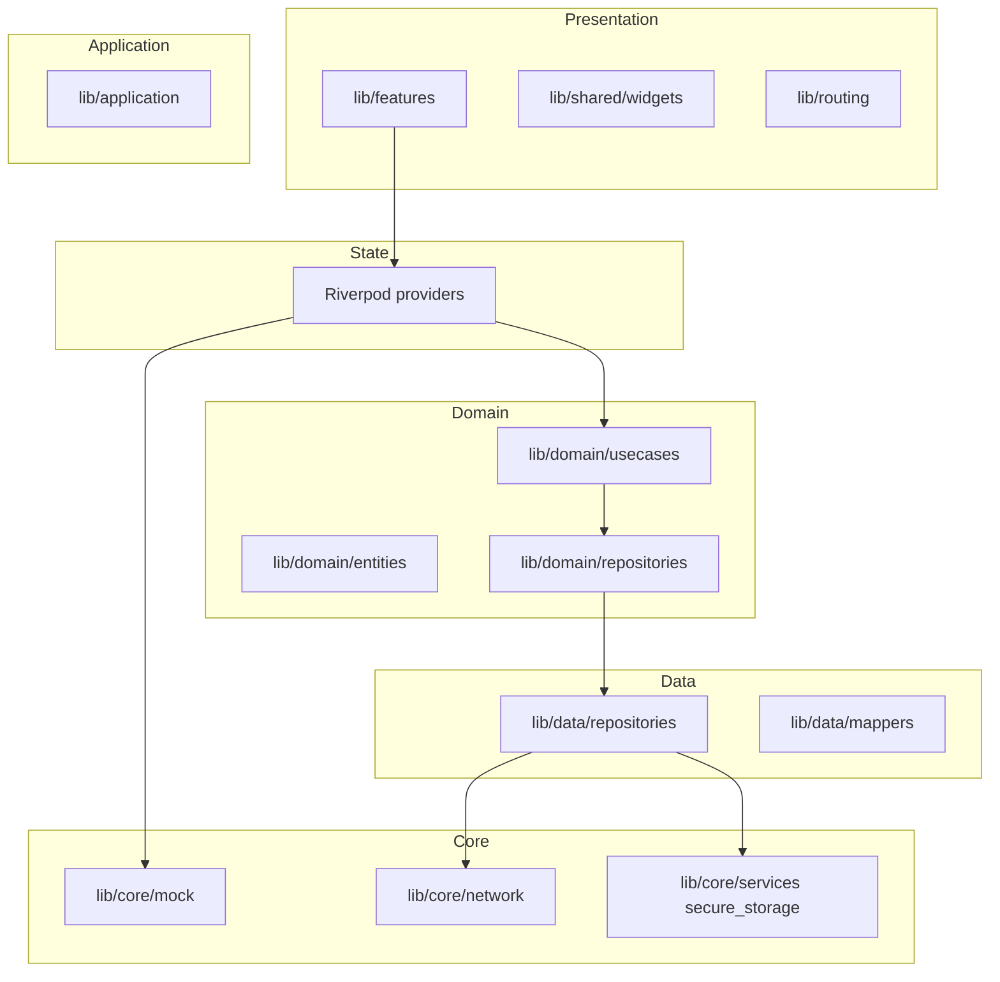
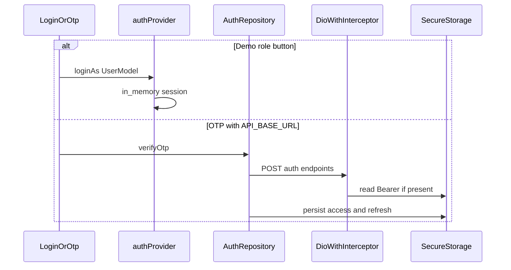
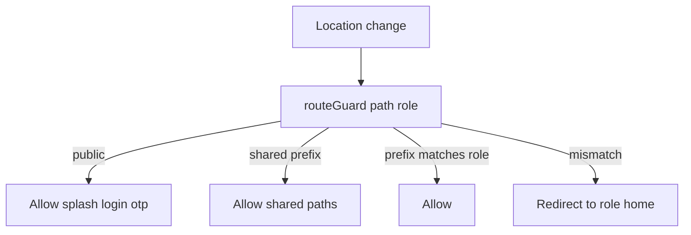

# NammaClass — Single-file codebase reference

Canonical map of **screens**, **roles**, **data flow**, **technology stack**, **per-feature behavior** (how code works), and **every `lib/` Dart file**. Historical sprint notes live in [PHASE6_DELIVERABLES.md](./PHASE6_DELIVERABLES.md); treat **this** document as the live checklist for routing and layout.

**Package:** `nammaclass` (Flutter 3.x, Riverpod, GoRouter, Dio, Drift).

---

## How to use this document

1. **Demo login** — On [login_screen.dart](../lib/features/auth/screens/login_screen.dart), role buttons call `authProvider.loginAs(UserModel.*)` with no backend.
2. **OTP login** — Requires `API_BASE_URL` (see [env_config.dart](../lib/core/config/env_config.dart)); [auth_repository_impl.dart](../lib/data/repositories/auth_repository_impl.dart) calls `POST /auth/otp/send` and `POST /auth/otp/verify`, then persists tokens.
3. **Web portal** — Routes under `/web/*` use [WebShell](../lib/features/web_shell.dart). On **viewport width &lt; 600**, [app_router.dart](../lib/routing/app_router.dart) may redirect certain destinations (e.g. HOD targets) to mobile homes — test wide and narrow layouts.
4. **Route security** — [route_guard.dart](../lib/routing/route_guard.dart) enforces prefix–role rules; tampering with another role’s path redirects to that user’s home.

---

## Architecture snapshot

Most feature UIs read **Riverpod** providers backed by **`lib/core/mock/mock_data.dart`**. **Auth, attendance, student pages, fees** also have **repository implementations** wired in [repository_providers.dart](../lib/application/di/repository_providers.dart); they call the API when `API_BASE_URL` is set, or return errors / empty paths as coded per repository.

---

## Technology stack (what the project uses)

| Layer | Technology | Role in this codebase |
|--------|------------|------------------------|
| **Framework** | Flutter (Dart SDK ^3.10) | Cross-platform UI (mobile primary; web/desktop via Flutter). |
| **State** | `flutter_riverpod` | `Provider`, `StateNotifierProvider`, `ConsumerWidget` / `ConsumerStatefulWidget`; global auth via `authProvider`. |
| **Navigation** | `go_router` | Declarative routes, nested shells (`MainShell`, `WebShell`); [app_router.dart](../lib/routing/app_router.dart) + [route_guard.dart](../lib/routing/route_guard.dart). |
| **HTTP** | `dio` | REST client; base URL from [env_config.dart](../lib/core/config/env_config.dart); [auth_interceptor.dart](../lib/core/network/auth_interceptor.dart) attaches JWT. |
| **Secure storage** | `flutter_secure_storage` | Access/refresh tokens; [secure_storage.dart](../lib/core/services/secure_storage.dart). |
| **Local DB** | `drift` (+ `drift_flutter`) | Typed SQLite for offline-friendly data (e.g. attendance queue); [app_database.dart](../lib/core/storage/app_database.dart), generated `app_database.g.dart`. |
| **JWT** | `jwt_decoder` | Decode access token payload after OTP (claims → `AuthCredentials`). |
| **Localization** | `flutter_localizations`, `intl` | Date/number formatting and locale-aware strings where used. |
| **UI** | Material, `google_fonts`, `shimmer`, `fl_chart`, `table_calendar`, `badges`, `pin_code_fields`, `cached_network_image`, `flutter_animate` | Design system in `lib/core/theme` and `lib/core/widgets/nc_*`; charts/calendar in academics and dashboards. |
| **Utilities** | `url_launcher`, `package_info_plus`, `connectivity_plus`, `uuid` | Links, app metadata, connectivity hints for sync layer. |

**Run lifecycle:** [main.dart](../lib/main.dart) wraps the tree in `ProviderScope`, installs debug keyboard hooks in non-release builds, routes errors through `AppLogger` / `ErrorFallback`, then mounts [app.dart](../lib/app.dart) which wires `MaterialApp.router` to `ref.watch(goRouterProvider)`.

**Architectural style:** **Feature-first folders** under `lib/features/*` (screens + local providers). **Clean-style** slices live under `lib/domain` (entities, repository interfaces, use cases), `lib/data` (repository implementations, mappers), and `lib/application` (DI, sync, auth mapping). Many screens still read **mock data** directly for demos; repositories are the path toward a real backend.

---

## Features: how the code works

Each area below lists **purpose**, **main code**, **flow**, and **data source** (mock vs API/DB).

### Routing & shells

**Purpose:** Map URLs to screens and enforce **role-based access**.

**Main code:** [app_router.dart](../lib/routing/app_router.dart), [route_guard.dart](../lib/routing/route_guard.dart), `*_shell_routes.dart`, [main_shell.dart](../lib/features/main_shell.dart), [web_shell.dart](../lib/features/web_shell.dart).

**How it works:** `GoRouter` is built from auth state (`ref.watch(authProvider)`). On navigation, `routeGuard` checks path prefixes against `_rolePrefixMap`; wrong role → redirect to `_roleHome`. Some `/web/*` targets redirect on narrow width via `mobileHomeForExecRole` (HOD). `ShellRoute` keeps a persistent scaffold (drawer/sidebar) while inner routes swap the child.

**Data:** None (pure navigation).

---

### Authentication (splash, login, OTP)

**Purpose:** Establish **who** is logged in (`UserModel` + `UserRole`).

**Main code:** [splash_screen.dart](../lib/features/auth/screens/splash_screen.dart), [login_screen.dart](../lib/features/auth/screens/login_screen.dart), [otp_screen.dart](../lib/features/auth/screens/otp_screen.dart), [auth_provider.dart](../lib/features/auth/providers/auth_provider.dart), [auth_repository_impl.dart](../lib/data/repositories/auth_repository_impl.dart).

**How it works:** **Demo:** `_loginDemo` calls `AuthNotifier.loginAs`, which sets `AuthState.currentUser` in memory and logs to [audit_log.dart](../lib/core/services/audit_log.dart). **OTP:** when `API_BASE_URL` is non-empty, repository posts to `/auth/otp/send` and `/auth/otp/verify`, persists tokens to secure storage, maps JWT to `AuthCredentials` / `UserModel` via [auth_mapper.dart](../lib/application/auth/auth_mapper.dart). Splash decides initial navigation based on stored session when implemented in splash logic.

**Data:** Demo in-memory; OTP → **Dio** + **SecureStorage**.

---

### Parent app

**Purpose:** Parent views child **attendance, fees, diary, bus, chat, notices, canteen, leave, complaints**.

**Main code:** [parent_providers.dart](../lib/features/parent/providers/parent_providers.dart), screens under [parent/screens/](../lib/features/parent/screens/).

**How it works:** `ConsumerWidget`s watch providers that derive lists (child linked by `UserModel` phone/name) from **mock** collections. Navigation uses `MainShell` routes under `/parent/*`. [canteen_screen.dart](../lib/features/parent/screens/canteen_screen.dart) embeds shared [food_canteen_screen.dart](../lib/features/canteen/screens/food_canteen_screen.dart).

**Data:** Primarily [mock_data.dart](../lib/core/mock/mock_data.dart). Fees UI can align later with `FeesRepository` / use cases when wired.

---

### Teacher app

**Purpose:** **Attendance** calendar and mark flow, **diary**, **students**, **leave** apply/approvals; optional **project timeline** UI.

**Main code:** [teacher_providers.dart](../lib/features/teacher/providers/teacher_providers.dart), attendance/diary/student/leave screens, timeline under [teacher/widgets/timeline/](../lib/features/teacher/widgets/timeline/).

**How it works:** Screens consume Riverpod state keyed by class/teacher context. Marking attendance can go through [mark_class_attendance_usecase.dart](../lib/domain/usecases/attendance/mark_class_attendance_usecase.dart) → [attendance_repository_impl.dart](../lib/data/repositories/attendance_repository_impl.dart) (**Drift** + **Dio**). Timeline widgets paint tasks/dependencies locally (models in [timeline_models.dart](../lib/features/teacher/models/timeline_models.dart)).

**Data:** Mixed — **mock** for most lists; **repository** for attendance when API/DB path is used.

---

### Student app

**Purpose:** **Home**, **academics** (including calendar/heatmap), **library**, **canteen**, **profile**.

**Main code:** [student_providers.dart](../lib/features/student/providers/student_providers.dart), [student_home_screen.dart](../lib/features/student/screens/student_home_screen.dart), [academics_screen.dart](../lib/features/student/screens/academics_screen.dart), [library_screen.dart](../lib/features/student/screens/library_screen.dart).

**How it works:** Providers filter mock data by `UserModel.studentId` / class. `table_calendar` drives attendance visualization where configured.

**Data:** **Mock**; library screen may use patterns similar to librarian mock provider.

---

### Admin & principal (mobile)

**Purpose:** **Dashboard**, **approvals**, **broadcast**, **people**, **add staff** from phone/tablet shell.

**Main code:** [admin_providers.dart](../lib/features/admin/providers/admin_providers.dart), admin screens, [add_staff_screen.dart](../lib/features/web/staff/add_staff_screen.dart) reused from web route on main shell.

**How it works:** KPI and list UIs; role `admin` / `principal` / `hod` share `/admin/*` prefix per guard. Same users often also use `/web/*`.

**Data:** **Mock** / static demo content in widgets.

---

### HOD (mobile + web)

**Purpose:** **HOD mobile home** (`/hod/*`) plus **admin** and **web** scope (per `UserRole.hod`).

**Main code:** [hod_home_screen.dart](../lib/features/hod/screens/hod_home_screen.dart), web route [webHodHome](../lib/routing/app_routes.dart).

**How it works:** Guard allows `/hod/`, `/admin/`, `/web/`. Layout redirect sends HOD to mobile home when viewport is narrow during certain redirects.

**Data:** Same as surrounding admin/web areas.

---

### Staff HR portal

**Purpose:** **Home**, **attendance**, **leaves** (reuses parent leave status UI), **payslips**, **training**, **canteen**.

**Main code:** [staff_providers.dart](../lib/features/staff/providers/staff_providers.dart), [staff_shell_routes.dart](../lib/routing/staff_shell_routes.dart).

**How it works:** `MainShell` with `/staff/*` routes. Providers filter mock rows by `UserModel.employeeId`. **Teachers** may also open this shell (prefix map includes `UserRole.teacher` for `/staff/`).

**Data:** **Mock**, filtered per employee.

---

### Driver app

**Purpose:** **Route** and **students by stop**.

**Main code:** [driver_provider.dart](../lib/features/driver/providers/driver_provider.dart), [driver_route_screen.dart](../lib/features/driver/screens/driver_route_screen.dart), [driver_students_screen.dart](../lib/features/driver/screens/driver_students_screen.dart).

**How it works:** Reads mock stops and student lists; UI focused lists and status.

**Data:** **Mock**.

---

### Librarian (mobile + web library)

**Purpose:** **Counter** (issue/return), **catalog**, **reservations** on mobile; **web library** modules for institution.

**Main code:** [library_provider.dart](../lib/features/librarian/providers/library_provider.dart), librarian screens; web: [web_library_screen.dart](../lib/features/web/library/web_library_screen.dart), reports screen.

**How it works:** Mobile shell under `/librarian/*`. Web shell adds `/web/library` and reports. **Librarian** role may use both per route guard.

**Data:** **Mock** in mobile provider; web screens largely demo tables.

---

### Warden (hostel)

**Purpose:** **Roll call**, **visitors**, **outpass**, home hub.

**Main code:** [warden_provider.dart](../lib/features/warden/providers/warden_provider.dart), warden screens.

**How it works:** List-centric flows for hostel operations; state in Riverpod notifier/provider pattern.

**Data:** **Mock**.

---

### Canteen staff

**Purpose:** **Counter** POS-style flow, **manager** screen, **catalog** sub-screen.

**Main code:** [canteen_provider.dart](../lib/features/canteen/providers/canteen_provider.dart), [canteen_counter_screen.dart](../lib/features/canteen/screens/canteen_counter_screen.dart), etc.

**How it works:** Catalog and orders held in provider state for demo; parent/student/staff use `FoodCanteenScreen` for ordering UX.

**Data:** **Mock**.

---

### Web ERP portal

**Purpose:** Desktop-style modules: **dashboard**, **analytics**, **students** (list, profile, bulk promotion), **timetable**, **marks**, **report cards**, **fees** (structure, collection, collect), **finance ledger**, **staff** (directory, payroll, add staff), **admissions**, **notices**, **library**, **transport**, **inventory**, **reports**, **settings** (users, integrations, security), **support**, **accountant dashboard**, **AI tools**, **website manager**.

**Main code:** [web_shell.dart](../lib/features/web_shell.dart), [web_shell_routes.dart](../lib/routing/web_shell_routes.dart), screens under [lib/features/web/](../lib/features/web/).

**How it works:** `WebShell` provides sidebar/layout; each route maps to a large `*Screen` widget, often with local `StatefulWidget` demo tables and charts (`fl_chart` where used). Eligible roles: admin, principal, accountant, teacher, librarian, support, hod (see guard).

**Data:** Mostly **in-widget demo** / static structures; student list pagination can use [get_students_page_usecase.dart](../lib/domain/usecases/student/get_students_page_usecase.dart) when connected.

---

### Shared modules (all authenticated roles)

**Purpose:** **Notifications**, **hostel** room info, **profile**, **school events**, **global search**.

**Main code:** [notifications_screen.dart](../lib/features/shared/notifications/notifications_screen.dart), [notices_for_user_provider.dart](../lib/features/shared/notifications/notices_for_user_provider.dart), [hostel_screen.dart](../lib/features/shared/hostel/hostel_screen.dart), [hostel_provider.dart](../lib/features/shared/hostel/hostel_provider.dart), [profile_screen.dart](../lib/features/shared/profile/profile_screen.dart), [school_events_screen.dart](../lib/features/shared/events/school_events_screen.dart), [global_search_screen.dart](../lib/features/shared/search/global_search_screen.dart).

**How it works:** Listed in `_sharedAuthPaths`; any logged-in user can open them without a role-specific prefix. Unread counts feed [notification_icon_button.dart](../lib/core/widgets/notification_icon_button.dart).

**Data:** **Mock** / derived providers.

---

### Domain, data, and sync (backend shape)

**Purpose:** Keep **business rules** and **API boundaries** testable and swappable.

**Main code:** `lib/domain/*`, `lib/data/repositories/*`, [repository_providers.dart](../lib/application/di/repository_providers.dart), [sync_queue_service.dart](../lib/application/sync/sync_queue_service.dart).

**How it works:** UI and feature providers call **use cases** that depend on **repository interfaces**. Implementations use **Dio** and/or **Drift**. `SyncQueueService` is intended to queue writes when offline (`connectivity_plus` in dependencies).

**Data:** **HTTP** when configured; **SQLite** via Drift for selected entities.

---

### Design system & shared widgets

**Purpose:** Consistent **colors, type, spacing**, and reusable **NC** / **App** components.

**Main code:** [app_theme.dart](../lib/core/theme/app_theme.dart), `nc_*` in [core/widgets/](../lib/core/widgets/), [shared/widgets/](../lib/shared/widgets/).

**How it works:** Screens compose `NcButton`, `NcCard`, etc.; web uses same tokens where applicable. [screen_size.dart](../lib/core/utils/screen_size.dart) drives responsive breakpoints.

**Data:** None.

---

## Authentication and session data flow

- **Token injection:** [auth_interceptor.dart](../lib/core/network/auth_interceptor.dart) reads the access token from `SecureStorage` for each request.
- **Logout:** [auth_provider.dart](../lib/features/auth/providers/auth_provider.dart) clears auth state; [logout_usecase.dart](../lib/domain/usecases/auth/logout_usecase.dart) can clear remote session via repository.

---

## Roles, home routes, and allowed path prefixes

Derived from [user_model.dart](../lib/core/models/user_model.dart) (`UserRole`, demo `UserModel.*`), [_roleHome / _rolePrefixMap](../lib/routing/route_guard.dart).

| Role | Default home route | Allowed URL prefixes (guard) | Notes |
|------|-------------------|------------------------------|--------|
| parent | `/parent/home` | `/parent/` | — |
| teacher | `/teacher/home` | `/teacher/`, `/staff/` | May open **staff** shell routes; full **web** portal. |
| student | `/student/home` | `/student/` | — |
| admin | `/admin/home` | `/admin/`, `/web/` | `hod` also under `/admin/`; admin/principal **not** under `/hod/`. |
| principal | `/admin/home` | `/admin/`, `/web/` | Same prefix set as admin. |
| accountant | `/web/accountant/dashboard` | `/web/` | Web-first persona. |
| support | `/web/support/dashboard` | `/web/` | — |
| staff | `/staff/home` | `/staff/` | Non-teacher staff; no `/teacher/`. |
| driver | `/driver/route` | `/driver/` | — |
| librarian | `/librarian/counter` | `/librarian/`, `/web/` | Mobile librarian + web library modules. |
| warden | `/warden/home` | `/warden/` | — |
| canteenStaff | `/canteen/counter` | `/canteen/` | — |
| hod | `/web/hod-home` | `/hod/`, `/admin/`, `/web/` | Mobile `/hod/*` + admin + web; narrow-width redirect in `app_router`. |

**Shared paths** (any authenticated role): `/notifications`, `/hostel`, `/profile`, `/events`, `/search` — see `_sharedAuthPaths` in [route_guard.dart](../lib/routing/route_guard.dart).

---

## Registered routes by shell (GoRouter)

Counts are **GoRoute** entries per file (not parameter-expanded duplicates).

| Shell file | Routes | Shell widget |
|------------|--------|----------------|
| [auth_routes.dart](../lib/routing/auth_routes.dart) | 3 | — |
| [main_shell_routes.dart](../lib/routing/main_shell_routes.dart) | 40 | `MainShell` |
| [web_shell_routes.dart](../lib/routing/web_shell_routes.dart) | 39 | `WebShell` |
| [staff_shell_routes.dart](../lib/routing/staff_shell_routes.dart) | 8 | `MainShell` |
| [driver_shell_routes.dart](../lib/routing/driver_shell_routes.dart) | 3 | `MainShell` |
| [librarian_shell_routes.dart](../lib/routing/librarian_shell_routes.dart) | 4 | `MainShell` |
| [warden_shell_routes.dart](../lib/routing/warden_shell_routes.dart) | 5 | `MainShell` |
| [canteen_shell_routes.dart](../lib/routing/canteen_shell_routes.dart) | 3 | `MainShell` |

**Auth paths:** `/splash`, `/login`, `/otp`.

**Constants without a matching `GoRoute` in these files:** `AppRoutes.foodMenu` (`/food`) and `AppRoutes.webHostel` (`/web/hostel`) in [app_routes.dart](../lib/routing/app_routes.dart). Canteen menu UX uses `/parent/canteen`, `/student/canteen`, `/staff/canteen` and [food_canteen_screen.dart](../lib/features/canteen/screens/food_canteen_screen.dart) via wrappers.

---

## Screens reachable by role (authorization-level)

Counts = **distinct path prefixes** you may open without guard redirect: role-specific routes + **5** shared routes. **Web** counts **39** routes (one row per `GoRoute` in `web_shell_routes.dart`).

| Role | Approx. reachable route slots | Main areas |
|------|-------------------------------|------------|
| parent | 14 + 5 = **19** | Parent module + shared |
| student | 5 + 5 = **10** | Student module + shared |
| staff | 7 + 5 = **12** | Staff shell (`/staff/*`) + shared |
| driver | 3 + 5 = **8** | Driver + shared |
| warden | 5 + 5 = **10** | Warden + shared |
| canteenStaff | 3 + 5 = **8** | Canteen + shared |
| admin | 6 + 39 + 5 = **50** | Admin mobile + full web + shared |
| principal | 6 + 39 + 5 = **50** | Same as admin |
| accountant | 39 + 5 = **44** | Web + shared |
| support | 39 + 5 = **44** | Web + shared |
| teacher | 8 + 7 + 39 + 5 = **59** | Teacher + staff + web + shared |
| librarian | 4 + 39 + 5 = **48** | Librarian + web + shared |
| hod | 6 + 2 + 39 + 5 = **52** | Admin + HOD mobile + web + shared |

### Parent — routes

`/parent/home`, `/parent/attendance`, `/parent/fees`, `/parent/diary`, `/parent/chat`, `/parent/chat/:tid`, `/parent/bus`, `/parent/notices`, `/parent/canteen`, `/parent/profile`, `/parent/leave-apply`, `/parent/leave-status`, `/parent/complaint-new`, `/parent/complaints`; plus `/notifications`, `/hostel`, `/profile`, `/events`, `/search`.

### Teacher — routes

`/teacher/home`, `/teacher/attendance`, `/teacher/attendance/mark`, `/teacher/diary`, `/teacher/students`, `/teacher/profile`, `/teacher/leave-apply`, `/teacher/leave-approvals`; **staff:** `/staff/home`, `/staff/attendance`, `/staff/leaves`, `/staff/payslips`, `/staff/training`, `/staff/canteen`, `/staff/profile`; **web:** all `AppRoutes.web*` registered in [web_shell_routes.dart](../lib/routing/web_shell_routes.dart); **shared** as above.

### Student — routes

`/student/home`, `/student/academics`, `/student/library`, `/student/canteen`, `/student/profile`; plus shared.

### Admin / principal — routes

`/admin/home`, `/admin/approvals`, `/admin/broadcast`, `/admin/people`, `/admin/staff/add`, `/admin/profile`; plus all **web** routes; plus shared. **No** `/hod/*` unless role is `hod`.

### HOD — routes

All **admin** paths above plus `/hod/home`, `/hod/profile`; plus **web**; plus shared.

### Staff — routes

`/staff/home`, `/staff/attendance`, `/staff/leaves`, `/staff/payslips`, `/staff/training`, `/staff/canteen`, `/staff/profile`, `/notifications`; plus `/hostel`, `/profile`, `/events`, `/search`.

### Driver — routes

`/driver/route`, `/driver/students`, `/driver/profile`; plus shared.

### Librarian — routes

`/librarian/counter`, `/librarian/catalog`, `/librarian/reservations`, `/librarian/profile`; plus **web**; plus shared.

### Warden — routes

`/warden/home`, `/warden/rollcall`, `/warden/visitors`, `/warden/outpass`, `/warden/profile`; plus shared.

### Canteen staff — routes

`/canteen/counter`, `/canteen/manage`, `/canteen/profile`; plus shared.

### Accountant — routes

All **web** routes (home defaults to `/web/accountant/dashboard`); plus shared.

### Support — routes

All **web** routes (home defaults to `/web/support/dashboard`); plus shared.

Path constants are defined in [app_routes.dart](../lib/routing/app_routes.dart).

---

## Feature ↔ data source matrix

| Domain | Typical UI entry | State / use case | Data source today |
|--------|------------------|------------------|-------------------|
| Auth | Login, OTP, splash | `authProvider`, `*AuthUseCase` | Demo memory **or** `AuthRepositoryImpl` + Dio when API configured |
| Students (paginated) | Web students | `GetStudentsPageUseCase` | `StudentRepositoryImpl` (Dio) |
| Fees | Parent fees, web fees | `GetFeesUseCase`, parent providers | `FeesRepositoryImpl` + mock in many screens |
| Attendance (mark) | Teacher mark screen | `MarkClassAttendanceUseCase` | `AttendanceRepositoryImpl` (Drift + Dio) |
| Notifications | `NotificationsScreen` | `notices_for_user_provider` | Mock / local composition |
| Parent child / leave | Parent home, leave | `parent_providers` | Mock filtered by `UserModel` |
| Staff HR | Staff shell | `staff_providers` | Mock filtered by `employeeId` |
| Driver | Driver screens | `driver_provider` | Mock |
| Library mobile | Librarian / student | `library_provider` | Mock |
| Warden | Warden screens | `warden_provider` | Mock |
| Canteen | Counter / manager | `canteen_provider` | Mock |
| Teacher timeline | Teacher widgets | `teacher_providers`, timeline models | Mock / local state |
| Web ERP modules | `lib/features/web/*` | `web_providers`, screen-local state | Mostly demo / static tables |

---

## Global navigation flow (guard)

---

## Tests (`test/`)

| File | Purpose |
|------|---------|
| [test/widget_test.dart](../test/widget_test.dart) | Default Flutter smoke template |
| [test/features/teacher/timeline_provider_test.dart](../test/features/teacher/timeline_provider_test.dart) | Teacher timeline provider behavior |
| [test/features/teacher/timeline_roadmap_view_test.dart](../test/features/teacher/timeline_roadmap_view_test.dart) | Timeline roadmap widget tests |

---

## Appendix — every `lib/*.dart` file (sorted)

One-line purpose for maintenance and onboarding.

| File | Purpose |
|------|---------|
| lib/app.dart | Root app widget: theme mode, locale, GoRouter, debug hooks. |
| lib/main.dart | `main()`, `ProviderScope`, runner entry. |
| lib/application/auth/auth_mapper.dart | Maps `AuthCredentials` / JWT payload to `UserModel`. |
| lib/application/di/repository_providers.dart | Riverpod: DB, Dio, repositories, use cases, sync queue. |
| lib/application/sync/sync_queue_service.dart | Offline/outbox sync orchestration for queues. |
| lib/core/auth/demo_permissions.dart | Demo role permission lists for UI gating. |
| lib/core/config/app_config.dart | Static app-level configuration flags. |
| lib/core/config/env_config.dart | Compiled-in env e.g. `API_BASE_URL`. |
| lib/core/constants/app_constants.dart | General app constants. |
| lib/core/constants/storage_keys.dart | Keys for secure/prefs storage. |
| lib/core/debug/raw_keyboard_debug_log.dart | Debug keyboard logging helper. |
| lib/core/errors/app_error.dart | Typed / wrapped application errors. |
| lib/core/extensions/context_extensions.dart | `BuildContext` helpers. |
| lib/core/extensions/num_extensions.dart | Numeric formatting / helpers. |
| lib/core/mock/mock_data.dart | Large demo dataset for feature providers. |
| lib/core/models/result.dart | `ResultSuccess` / `ResultError` wrapper. |
| lib/core/models/user_model.dart | `UserRole`, `UserModel`, demo user constants. |
| lib/core/network/auth_interceptor.dart | Dio: Bearer header, 401 refresh hook placeholder. |
| lib/core/network/dio_client.dart | Riverpod `dioProvider` and `createDio`. |
| lib/core/network/jwt_tokens.dart | JWT decode / payload helpers. |
| lib/core/providers/data_sync_provider.dart | Sync state / triggers for data layer. |
| lib/core/providers/secure_storage_provider.dart | Riverpod `SecureStorage` singleton. |
| lib/core/providers/theme_mode_provider.dart | Theme mode (light/dark/system). |
| lib/core/services/app_logger.dart | Logging abstraction. |
| lib/core/services/audit_log.dart | In-app audit trail for auth events. |
| lib/core/services/secure_storage.dart | Wrapper around `flutter_secure_storage`. |
| lib/core/storage/app_database.dart | Drift database definition. |
| lib/core/storage/app_database.g.dart | Drift generated code. |
| lib/core/tenant/tenant_config_loader.dart | Merge entitlement payloads into [TenantProfile](../lib/domain/entities/tenant_profile.dart). |
| lib/core/tenant/tenant_entitlement_resolver.dart | `visibleNavItems` for dynamic shell from `nav_graph`. |
| lib/core/tenant/user_role_config_key.dart | Maps [UserRole](../lib/core/models/user_model.dart) to tenant config keys. |
| lib/core/theme/app_colors.dart | Color tokens. |
| lib/core/theme/app_glass_theme.dart | Glass / blur styling helpers. |
| lib/core/theme/app_spacing.dart | Spacing scale. |
| lib/core/theme/app_theme.dart | `ThemeData` assembly. |
| lib/core/theme/app_typography.dart | Text styles. |
| lib/core/utils/agent_debug_logger.dart | Conditional agent debug logger export. |
| lib/core/utils/agent_debug_logger_io.dart | IO implementation for agent logger. |
| lib/core/utils/agent_debug_logger_stub.dart | Stub implementation for agent logger. |
| lib/core/utils/app_animations.dart | Shared animation curves / durations. |
| lib/core/utils/extensions.dart | Misc Dart extensions. |
| lib/core/utils/formatters.dart | Date / number formatters. |
| lib/core/utils/launch_utils.dart | URL / external launch helpers. |
| lib/core/utils/platform_utils.dart | Platform detection helpers. |
| lib/core/utils/sanitization.dart | Input sanitization e.g. phone. |
| lib/core/utils/screen_size.dart | Breakpoints (mobile/tablet/desktop). |
| lib/core/utils/validators.dart | Form validators. |
| lib/core/widgets/app_drawer.dart | Role-aware navigation drawer. |
| lib/core/widgets/error_fallback.dart | Error boundary / fallback UI. |
| lib/core/widgets/nc_async_error.dart | Async error presentation widget. |
| lib/core/widgets/nc_avatar.dart | Design-system avatar. |
| lib/core/widgets/nc_bottom_sheet.dart | Bottom sheet wrapper. |
| lib/core/widgets/nc_button.dart | Primary button component. |
| lib/core/widgets/nc_card.dart | Card container. |
| lib/core/widgets/nc_chip.dart | Chip / tag component. |
| lib/core/widgets/nc_empty_state.dart | Empty state illustration block. |
| lib/core/widgets/nc_input.dart | Text field component. |
| lib/core/widgets/nc_shimmer.dart | Loading shimmer. |
| lib/core/widgets/notification_icon_button.dart | Bell icon with unread badge. |
| lib/core/widgets/role_guard.dart | Hides child when role not allowed. |
| lib/core/widgets/shell_layout_scope.dart | Inherited scope for shell layout. |
| lib/data/mappers/fee_mapper.dart | Maps fee DTOs ↔ domain entities. |
| lib/data/mappers/student_mapper.dart | Maps student DTOs ↔ domain entities. |
| lib/data/mock/mock_data.dart | Legacy / alternate mock data (data layer). |
| lib/data/repositories/attendance_repository_impl.dart | Attendance: local DB + API. |
| lib/data/repositories/auth_repository_impl.dart | OTP, session persist, logout API. |
| lib/data/repositories/fees_repository_impl.dart | Fees API repository. |
| lib/data/repositories/student_repository_impl.dart | Student list / detail API. |
| lib/domain/constants/demo_tenant.dart | Demo tenant id constant. |
| lib/domain/entities/attendance_entities.dart | Attendance domain types. |
| lib/domain/entities/auth_credentials.dart | Tokens + claims entity. |
| lib/domain/entities/entitlement_snapshot.dart | Billing snapshot: modules, limits, `snapshot_version`. |
| lib/domain/entities/fee_installment_entity.dart | Fee installment entity. |
| lib/domain/entities/role_pack_definition.dart | Role pack template parse model. |
| lib/domain/entities/student_entity.dart | Student entity. |
| lib/domain/entities/theme_tokens.dart | Semantic white-label theme tokens. |
| lib/domain/entities/tenant_nav_item.dart | One dynamic navigation entry. |
| lib/domain/entities/tenant_profile.dart | Tenant branding, features, optional entitlements + nav. |
| lib/domain/repositories/attendance_repository.dart | Attendance repository interface. |
| lib/domain/repositories/auth_repository.dart | Auth repository interface. |
| lib/domain/repositories/fees_repository.dart | Fees repository interface. |
| lib/domain/repositories/student_repository.dart | Student repository interface. |
| lib/domain/usecases/attendance/mark_class_attendance_usecase.dart | Mark attendance use case. |
| lib/domain/usecases/auth/login_demo_usecase.dart | Demo login via repository no-op path. |
| lib/domain/usecases/auth/logout_usecase.dart | Logout use case. |
| lib/domain/usecases/auth/send_otp_usecase.dart | Send OTP use case. |
| lib/domain/usecases/auth/verify_otp_usecase.dart | Verify OTP use case. |
| lib/domain/usecases/fees/get_fees_usecase.dart | Fetch fees use case. |
| lib/domain/usecases/student/get_students_page_usecase.dart | Paginated students use case. |
| lib/features/admin/providers/admin_providers.dart | Admin feature Riverpod providers. |
| lib/features/admin/providers/staff_notifier.dart | Staff list / mutations notifier. |
| lib/features/admin/screens/admin_dash_screen.dart | Admin dashboard. |
| lib/features/admin/screens/approvals_screen.dart | Approvals queue UI. |
| lib/features/admin/screens/broadcast_screen.dart | Broadcast messages UI. |
| lib/features/admin/screens/people_screen.dart | People directory UI. |
| lib/features/auth/providers/auth_provider.dart | `AuthState`, `AuthNotifier`, `authProvider`. |
| lib/features/auth/screens/login_screen.dart | Phone / demo login. |
| lib/features/auth/screens/otp_screen.dart | OTP entry screen. |
| lib/features/auth/screens/splash_screen.dart | Splash + restore / route bootstrap. |
| lib/features/canteen/providers/canteen_provider.dart | Canteen catalog / orders state. |
| lib/features/canteen/screens/canteen_counter_catalog_screen.dart | Counter catalog picker. |
| lib/features/canteen/screens/canteen_counter_screen.dart | POS-style counter UI. |
| lib/features/canteen/screens/canteen_manager_screen.dart | Manager inventory / pricing UI. |
| lib/features/canteen/screens/food_canteen_screen.dart | Shared menu + wallet UX. |
| lib/features/dashboard/presentation/dashboard_screen.dart | Legacy/generic dashboard placeholder. |
| lib/features/driver/providers/driver_provider.dart | Bus stops / roster state. |
| lib/features/driver/screens/driver_route_screen.dart | Driver route overview. |
| lib/features/driver/screens/driver_students_screen.dart | Students at stop list. |
| lib/features/hod/screens/hod_home_screen.dart | HOD mobile home. |
| lib/features/librarian/providers/library_provider.dart | Loans / catalog state. |
| lib/features/librarian/screens/librarian_catalog_screen.dart | Librarian catalog management. |
| lib/features/librarian/screens/librarian_counter_screen.dart | Issue / return counter. |
| lib/features/librarian/screens/librarian_reservations_screen.dart | Reservations list. |
| lib/features/main_shell.dart | Mobile main shell (drawer + child). |
| lib/features/parent/providers/parent_providers.dart | Child, attendance, leave providers. |
| lib/features/parent/screens/bus_tracking_screen.dart | Parent bus tracking map/list. |
| lib/features/parent/screens/canteen_screen.dart | Wraps `FoodCanteenScreen` for parent. |
| lib/features/parent/screens/chat_thread_screen.dart | Chat thread UI. |
| lib/features/parent/screens/parent_attendance_screen.dart | Child attendance view. |
| lib/features/parent/screens/parent_chat_list_screen.dart | Chat list. |
| lib/features/parent/screens/parent_complaint_new_screen.dart | File new complaint. |
| lib/features/parent/screens/parent_complaints_screen.dart | Complaints history. |
| lib/features/parent/screens/parent_diary_screen.dart | Diary / homework view. |
| lib/features/parent/screens/parent_fees_screen.dart | Fees / installments UI. |
| lib/features/parent/screens/parent_home_screen.dart | Parent home dashboard. |
| lib/features/parent/screens/parent_leave_apply_screen.dart | Apply leave for child. |
| lib/features/parent/screens/parent_leave_status_screen.dart | Leave status tracking (also staff leaves). |
| lib/features/parent/screens/parent_notices_screen.dart | Notices for parent. |
| lib/features/settings/presentation/settings_screen.dart | User settings UI (non-web). |
| lib/features/shared/events/school_events_screen.dart | School events calendar/list. |
| lib/features/shared/hostel/hostel_provider.dart | Hostel room assignment state. |
| lib/features/shared/hostel/hostel_screen.dart | Hostel room UX. |
| lib/features/shared/notifications/notices_for_user_provider.dart | Unread / filtered notices provider. |
| lib/features/shared/notifications/notification_service.dart | Local notification hooks. |
| lib/features/shared/notifications/notifications_screen.dart | Notification inbox UI. |
| lib/features/shared/profile/profile_screen.dart | Shared profile screen. |
| lib/features/shared/search/global_search_screen.dart | Global search UI. |
| lib/features/staff/providers/staff_providers.dart | Payslips / attendance mock filters. |
| lib/features/staff/screens/staff_attendance_screen.dart | Staff punch / attendance view. |
| lib/features/staff/screens/staff_home_screen.dart | Staff portal home. |
| lib/features/staff/screens/staff_payslips_screen.dart | Payslips list. |
| lib/features/staff/screens/staff_training_screen.dart | Training modules list. |
| lib/features/student/providers/student_providers.dart | Student timetable / mocks. |
| lib/features/student/screens/academics_screen.dart | Academics + attendance heatmap. |
| lib/features/student/screens/library_screen.dart | Student library view. |
| lib/features/student/screens/student_home_screen.dart | Student home dashboard. |
| lib/features/tenant/providers/tenant_provider.dart | `tenantProvider`, `tenantProfileProvider`, `visibleTenantNavItemsProvider`. |
| lib/features/teacher/models/timeline_models.dart | Timeline domain models. |
| lib/features/teacher/providers/teacher_providers.dart | Timeline / class context state. |
| lib/features/teacher/screens/attendance_calendar_screen.dart | Teacher attendance calendar. |
| lib/features/teacher/screens/attendance_mark_screen.dart | Mark class attendance UI. |
| lib/features/teacher/screens/diary_entry_screen.dart | Diary entry editor. |
| lib/features/teacher/screens/my_students_screen.dart | Class roster. |
| lib/features/teacher/screens/teacher_home_screen.dart | Teacher home dashboard. |
| lib/features/teacher/screens/teacher_leave_apply_screen.dart | Teacher leave application. |
| lib/features/teacher/screens/teacher_leave_approvals_screen.dart | Leave approvals for coordinator. |
| lib/features/teacher/widgets/timeline/timeline_canvas.dart | Timeline canvas painter / layout. |
| lib/features/teacher/widgets/timeline/timeline_dependency_layer.dart | Dependency arrows layer. |
| lib/features/teacher/widgets/timeline/timeline_filters_toolbar.dart | Timeline filter controls. |
| lib/features/teacher/widgets/timeline/timeline_header.dart | Timeline header row. |
| lib/features/teacher/widgets/timeline/timeline_hierarchy_panel.dart | Hierarchy side panel. |
| lib/features/teacher/widgets/timeline/timeline_roadmap_view.dart | Roadmap Gantt-style view. |
| lib/features/teacher/widgets/timeline/timeline_task_bar.dart | Task bar rendering. |
| lib/features/teacher/widgets/timeline/timeline_view_utils.dart | Timeline math / hit testing. |
| lib/features/warden/providers/warden_provider.dart | Roll call / visitors state. |
| lib/features/warden/screens/warden_home_screen.dart | Warden home. |
| lib/features/warden/screens/warden_outpass_screen.dart | Outpass requests UI. |
| lib/features/warden/screens/warden_rollcall_screen.dart | Nightly roll call UI. |
| lib/features/warden/screens/warden_visitors_screen.dart | Visitor log UI. |
| lib/features/web_shell.dart | Web portal shell layout / nav. |
| lib/features/web/academics/web_marks_entry_screen.dart | Web marks entry grid. |
| lib/features/web/academics/web_report_card_builder_screen.dart | Report card builder. |
| lib/features/web/academics/web_timetable_screen.dart | Institution timetable editor/view. |
| lib/features/web/accountant/web_accountant_dashboard_screen.dart | Accountant landing dashboard. |
| lib/features/web/admissions/web_admission_dashboard_screen.dart | Admissions funnel dashboard. |
| lib/features/web/admissions/web_application_detail_screen.dart | Single application detail. |
| lib/features/web/admissions/web_enquiries_screen.dart | Enquiries list / CRM lite. |
| lib/features/web/ai_tools/web_ai_tools_screen.dart | AI tools marketing / stubs. |
| lib/features/web/analytics/web_analytics_screen.dart | Analytics KPIs. |
| lib/features/web/analytics/web_report_builder_screen.dart | Custom report builder UI. |
| lib/features/web/communication/web_communication_analytics_screen.dart | Comms analytics dashboard. |
| lib/features/web/communication/web_notices_screen.dart | Web notices composer/list. |
| lib/features/web/dashboard/web_dashboard_screen.dart | Executive web dashboard. |
| lib/features/web/fees/web_fee_collect_screen.dart | Fee collection POS-style. |
| lib/features/web/fees/web_fee_collection_screen.dart | Fee collection overview. |
| lib/features/web/fees/web_fee_structure_screen.dart | Fee structure config. |
| lib/features/web/finance/web_finance_ledger_screen.dart | Finance ledger UI. |
| lib/features/web/inventory/web_inventory_assets_screen.dart | Fixed assets registry. |
| lib/features/web/inventory/web_inventory_stock_screen.dart | Stock inventory UI. |
| lib/features/web/library/web_library_reports_screen.dart | Library circulation reports. |
| lib/features/web/library/web_library_screen.dart | Web library admin. |
| lib/features/web/providers/web_providers.dart | Shared web dashboard providers. |
| lib/features/web/settings/web_integrations_screen.dart | Integrations settings. |
| lib/features/web/settings/web_security_log_screen.dart | Security audit log viewer. |
| lib/features/web/settings/web_settings_screen.dart | Web settings hub. |
| lib/features/web/settings/web_user_management_screen.dart | Users / roles admin UI. |
| lib/features/web/staff/add_staff_screen.dart | Add / edit staff (web + admin route). |
| lib/features/web/staff/web_payroll_screen.dart | Payroll UI. |
| lib/features/web/staff/web_staff_screen.dart | Staff directory web. |
| lib/features/web/students/web_bulk_promotion_screen.dart | Bulk class promotion UI. |
| lib/features/web/students/web_student_profile.dart | Student 360 profile. |
| lib/features/web/students/web_students_screen.dart | Student list / filters. |
| lib/features/web/support/web_support_complaints_screen.dart | Support complaints queue. |
| lib/features/web/support/web_support_dashboard_screen.dart | Support home dashboard. |
| lib/features/web/support/web_support_knowledge_base_screen.dart | KB articles UI. |
| lib/features/web/support/web_support_tickets_screen.dart | Support tickets list. |
| lib/features/web/transport/web_transport_live_screen.dart | Live GPS / buses UI. |
| lib/features/web/transport/web_transport_routes_screen.dart | Route definitions. |
| lib/features/web/website/web_website_manager_screen.dart | Public website CMS lite. |
| lib/routing/app_router.dart | `goRouterProvider`, redirect logic. |
| lib/routing/app_routes.dart | Path constants `AppRoutes`. |
| lib/routing/auth_routes.dart | Splash, login, OTP routes. |
| lib/routing/canteen_shell_routes.dart | Canteen `ShellRoute` table. |
| lib/routing/driver_shell_routes.dart | Driver `ShellRoute` table. |
| lib/routing/librarian_shell_routes.dart | Librarian `ShellRoute` table. |
| lib/routing/main_shell_routes.dart | Main mobile `ShellRoute` table. |
| lib/routing/page_transitions.dart | Shared `CustomTransitionPage` helpers. |
| lib/routing/route_guard.dart | `routeGuard`, `_roleHome`, prefix map. |
| lib/routing/staff_shell_routes.dart | Staff `ShellRoute` table. |
| lib/routing/warden_shell_routes.dart | Warden `ShellRoute` table. |
| lib/routing/web_shell_routes.dart | Web portal `ShellRoute` table. |
| lib/shared/services/api_client.dart | Legacy/simple API client. |
| lib/shared/services/api_client_provider.dart | Riverpod provider for API client. |
| lib/shared/services/auth_service.dart | Legacy auth helper service. |
| lib/shared/widgets/buttons/app_button.dart | Shared app button. |
| lib/shared/widgets/buttons/app_icon_button.dart | Icon button variant. |
| lib/shared/widgets/cards/app_card.dart | Shared card. |
| lib/shared/widgets/cards/app_list_tile_card.dart | List tile card. |
| lib/shared/widgets/cards/app_stat_card.dart | KPI stat card. |
| lib/shared/widgets/feedback/app_dialog.dart | App dialog wrapper. |
| lib/shared/widgets/feedback/app_skeleton.dart | Skeleton loader. |
| lib/shared/widgets/feedback/app_skeleton_list.dart | List of skeleton rows. |
| lib/shared/widgets/feedback/app_snackbar.dart | Snackbar helper. |
| lib/shared/widgets/inputs/app_checkbox.dart | Checkbox input. |
| lib/shared/widgets/inputs/app_dropdown.dart | Dropdown input. |
| lib/shared/widgets/inputs/app_radio.dart | Radio input. |
| lib/shared/widgets/inputs/app_text_field.dart | Text field input. |
| lib/shared/widgets/layout/constrained_content.dart | Max-width content wrapper. |
| lib/shared/widgets/layout/responsive_builder.dart | Responsive layout builder. |
| lib/shared/widgets/lists/app_list_view.dart | Virtualized / styled list view. |
| lib/shared/widgets/navigation/app_app_bar.dart | Shared `AppBar` patterns. |
| lib/shared/widgets/tables/app_data_table.dart | Data table widget. |

**Total library Dart files indexed:** 233 (includes `app_database.g.dart`).

---

## Multi-tenant ERP blueprint (reference docs)

| Topic | Document |
|-------|----------|
| JSON schemas | [schemas/README.md](./schemas/README.md) |
| REST conventions | [API_STYLE_GUIDE.md](./API_STYLE_GUIDE.md) |
| INR SKUs & meters | [BILLING_INR_CATALOG.md](./BILLING_INR_CATALOG.md) |
| Module specs | [modules/MODULE_SPEC_TEMPLATE.md](./modules/MODULE_SPEC_TEMPLATE.md), [attendance](./modules/attendance.md), [fees](./modules/fees.md), [academics](./modules/academics.md), [communication](./modules/communication.md) |
| Platform Super Admin | [SUPER_ADMIN_CONSOLE.md](./SUPER_ADMIN_CONSOLE.md) |
| Offline sync / outbox | [OFFLINE_SYNC_ARCHITECTURE.md](./OFFLINE_SYNC_ARCHITECTURE.md) |
| Roadmap & team | [ERP_ROADMAP_PHASES.md](./ERP_ROADMAP_PHASES.md) |
| Example tenant JSON | [examples/tenant_config.full.json](./examples/tenant_config.full.json) |

**Client wiring:** [`TenantProfile.hasFeature`](../lib/domain/entities/tenant_profile.dart) prefers `entitlement_snapshot.modules` over the legacy `features` list. [`route_guard.dart`](../lib/routing/route_guard.dart) uses this for feature-gated routes. [`visibleTenantNavItemsProvider`](../lib/features/tenant/providers/tenant_provider.dart) exposes `nav_graph` filtered by role.

---

_End of document. For Windows Flutter debugging tips see [WINDOWS_FLUTTER_DEBUG.md](./WINDOWS_FLUTTER_DEBUG.md)._
