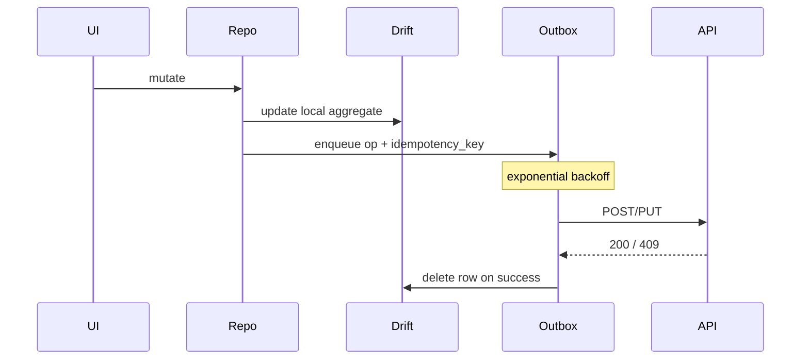

# Offline-first sync — NammaClass

## Goals

- **Local-first reads** for demo-critical flows (attendance, diary, chat, canteen order).
- **Reliable writes** via outbox + retries with backoff.
- **Multi-tenant safety:** every Drift row carrying institutional scope must include `tenant_id` when backend is wired (today: single-tenant demo).

## Current implementation

- **Queue:** [`SyncQueueEntries`](../lib/core/storage/app_database.dart) + [`SyncQueueService`](../lib/application/sync/sync_queue_service.dart)
- **Operations:** `mark_attendance`, `post_diary`, `send_chat`, `canteen_order`
- **Drain trigger:** connectivity / foreground hooks (integrate via [`data_sync_provider.dart`](../lib/core/providers/data_sync_provider.dart) as product hardens)

## Target architecture (outbox pattern)

## Drift table ownership (by aggregate)

| Aggregate | Local read cache | Outbox op | Conflict policy |
|-----------|------------------|-----------|-----------------|
| Attendance marks | `attendance_local`* | `mark_attendance` | Server revision wins; correction = new row |
| Diary posts | diary entries | `post_diary` | merge by `updated_at`; edit creates version |
| Chat messages | message threads | `send_chat` | duplicate `client_msg_id` dedup |
| Canteen orders | cart / orders | `canteen_order` | inventory validation on server |
| Fees | statements | *(no optimistic pay)* | N/A |

\*Table names illustrative until normalized in `app_database.dart`.

## Batching & performance

- **Wi-Fi preferred:** drain large `attendance/batch` payloads on unmetered networks.
- **Payload caps:** split >500 rows per request.
- **Isolate:** JSON encode / CSV export off main thread.

## Entitlements interaction

- If **module disabled** mid-flight: finish in-flight queue with **403 handler** → mark row failed + user-visible “Feature removed by admin”.

## Related docs

- [API_STYLE_GUIDE.md](API_STYLE_GUIDE.md) — idempotency, pagination
- [schemas/entitlement_snapshot.schema.json](schemas/entitlement_snapshot.schema.json)
