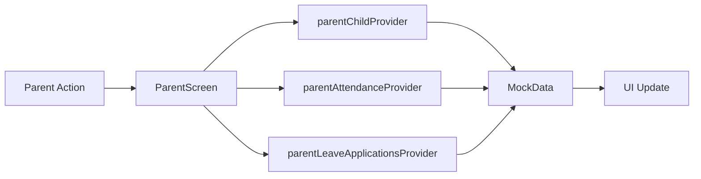
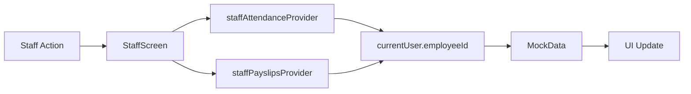
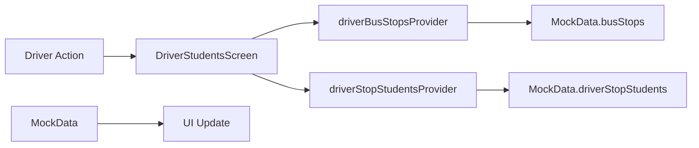
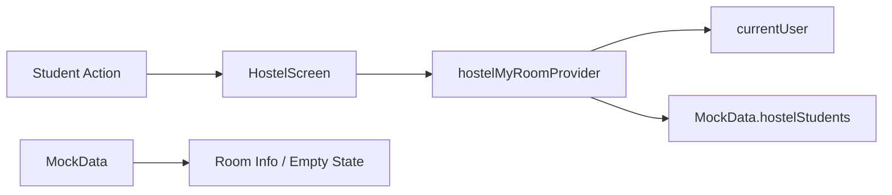

# NammaClass ERP — Phase 6 Deliverables

## 1. PROJECT MAP

### File Structure (Abridged)

```
lib/
├── main.dart, app.dart
├── core/
│   ├── constants/app_constants.dart
│   ├── mock/mock_data.dart
│   ├── models/user_model.dart (UserRole enum: 15 roles)
│   ├── theme/ (app_colors, app_theme, app_spacing, app_typography)
│   ├── utils/ (screen_size, app_animations, formatters, validators)
│   └── widgets/ (nc_*, notification_icon_button, role_guard, app_drawer)
├── features/
│   ├── auth/ (login, otp, splash)
│   ├── admin/ (dash, approvals, broadcast, people)
│   ├── parent/, teacher/, student/, staff/, driver/, librarian/, warden/, canteen/
│   ├── shared/ (notifications, profile, events, hostel, search)
│   └── web/ (dashboard, students, fees, staff, admissions, academics, etc.)
└── routing/ (app_router, app_routes, route_guard, *_shell_routes)
```

### State Management

- **Riverpod** (ProviderScope in main.dart)
- Providers: `authProvider`, `userRoleProvider`, `currentUserProvider`, feature-specific providers

### Router

- **GoRouter** with `routeGuard` redirect
- Shell routes: main_shell, staff_shell, driver_shell, librarian_shell, warden_shell, canteen_shell, web_shell

---

## 2. ROLE × SCREEN MATRIX (Summary)

| Role          | Home        | Web Dashboard | Attendance | Profile | Notifications |
|---------------|-------------|---------------|------------|---------|---------------|
| superAdmin    | /web/       | ✅            | N/A        | ✅      | ✅            |
| admin         | adminHome   | ✅            | N/A        | ✅      | ✅            |
| principal     | adminHome   | ✅            | N/A        | ✅      | ✅            |
| hod           | /web/       | ✅ (filtered) | N/A        | ✅      | ✅            |
| teacher       | teacherHome | ✅            | ✅ mark    | ✅      | ✅            |
| student       | studentHome | N/A           | ✅ view    | ✅      | ✅            |
| parent        | parentHome  | N/A           | ✅ view    | ✅      | ✅            |
| accountant    | /web/       | ✅            | N/A        | ✅      | ✅            |
| librarian     | librarianHome | web/library | N/A      | ✅      | ✅            |
| examController| /web/       | ✅ (exam flow)| N/A        | ✅      | ✅            |
| staff         | staffHome   | ✅            | ✅         | ✅      | ✅            |
| driver        | driverHome  | N/A           | N/A        | ✅      | ✅            |
| warden        | wardenHome  | N/A           | ✅         | ✅      | ✅            |
| canteenStaff  | canteenHome | N/A           | N/A        | ✅      | ✅            |
| support       | /web/       | ✅            | N/A        | ✅      | ✅            |

---

## 3. DATA FLOW DIAGRAMS (Mermaid)

### Parent Module



### Staff Module



### Driver Module



### Hostel Module (Student)



---

## 4. BUG REPORT

| File                     | Issue                         | Fix                                             | Verification        |
|--------------------------|-------------------------------|-------------------------------------------------|---------------------|
| splash_screen.dart       | Warden redirect used wardenRollcall | Unified to wardenHome                   | Warden lands on home |
| splash_screen.dart       | String-based role parsing     | Replaced with switch(role) on UserRole          | All roles route OK  |
| parent_providers.dart    | parentChildProvider returned first student | Filter by currentUser.phone/parentName  | Correct child shown  |
| parent_providers.dart    | Leave data for wrong child    | Added parentLeaveApplicationsProvider filtered   | Correct leave list   |
| staff_providers.dart     | Same data for all staff       | Filter by currentUser.employeeId                | Per-staff data       |
| driver_students_screen.dart | Hardcoded stop groups       | Use driverBusStopsProvider, driverStopStudentsProvider | Dynamic data   |
| hostel_screen.dart       | Hardcoded room info           | Use hostelMyRoomProvider                        | Room or empty state  |
| academics_screen.dart    | CalendarBuilders closing `}`  | Fixed to `)` for constructor                    | Compiles, heatmap OK |

---

## 5. CODE CHANGES SUMMARY

- **Phase 1:** user_model.dart (3 roles), route_guard.dart, splash_screen.dart, web_shell.dart menus
- **Phase 2:** parent_providers.dart, parent_leave_status_screen.dart, staff_providers.dart, mock_data.dart, driver_provider.dart, driver_students_screen.dart, hostel_provider.dart, hostel_screen.dart
- **Phase 4A–C:** app_colors.dart (primaryDark, shadows), screen_size.dart, app_animations.dart
- **Phase 4E:** role_guard.dart, app_drawer.dart
- **Phase 4D:** admin_dash_screen.dart (responsive KPI grid)
- **Phase 5:** notices_for_user_provider.dart (unread count), notification_icon_button.dart, teacher/parent/student home (badge), web_timetable_screen.dart (week/day toggle), academics_screen.dart (attendance heatmap), student_home_screen (duplicate Canteen card removed)

---

## 6. DESIGN SYSTEM

- **Colors:** primary #1B4F72, accent #E67E22, success #1E8449, primaryDark, shadowSm/Md/Lg
- **Spacing:** xs=4, sm=8, md=16, lg=24, xl=32, xxl=48
- **Radius:** sm=8, md=12, lg=20 (AppRadius)
- **Screen size:** isMobile <600, isTablet 600–1023, isDesktop ≥1024 (ScreenSize)
- **Animations:** app_animations.dart — durations and helpers

---

## 7. COMPONENT LIBRARY

- **Existing:** NcCard, NcButton, NcInput, NcAvatar, NcChip, NcShimmer, NcEmptyState
- **Added:** RoleGuard, AppDrawer, NotificationIconButton
- **Shared:** AppStatCard, AppDataTable (in lib/shared/widgets/)

---

## 8. REDESIGNED SCREENS

- Login: centered card, animations, responsive (wide/narrow)
- Admin dashboard: greeting, role badge, responsive KPI grid (4/2/horizontal)
- Teacher/Parent/Student home: SliverAppBar, stat cards, schedule, quick actions
- Notifications: grouped list, unread badge on nav
- Profile: gradient header, sections, theme toggle
- Web timetable: week/day toggle, Day view for single-day schedule
- Student academics: attendance heatmap calendar in Attendance tab

---

## 9. FEATURE ROADMAP

### Sprint 1 (Completed)

- Role-specific dashboards
- In-app notification center with unread count
- Attendance calendar heatmap (student)
- Timetable week/day toggle
- Empty and loading states (NcEmptyState, NcShimmer)

### Sprint 2–3 (Documented)

- Leave request workflow
- Fee payment status
- Library search/issue-return
- Exam schedule/hall ticket
- Progress report card
- Bulk attendance CSV UI
- Messaging

---

## 10. FINAL SUMMARY (5-Bullet for Swasthik)

1. **Broken:** Warden redirect mismatch, parent child/leave data for wrong user, staff/driver/hostel hardcoded data, splash string parsing.
2. **Fixed:** Unified warden route, role-based data filters (parent, staff, driver, hostel), switch-based role routing, provider-driven screens.
3. **Redesigned:** Admin dash (responsive KPIs), login layout, profile, notifications with badge, web timetable (week/day), student attendance heatmap.
4. **Next:** Sprint 2–3 features (leave workflow, fees, library, exams, reports, messaging).
5. **Handoff:** Codebase is structured, role-safe, data-filtered; design system and components in place; Phase 6 deliverables documented.
